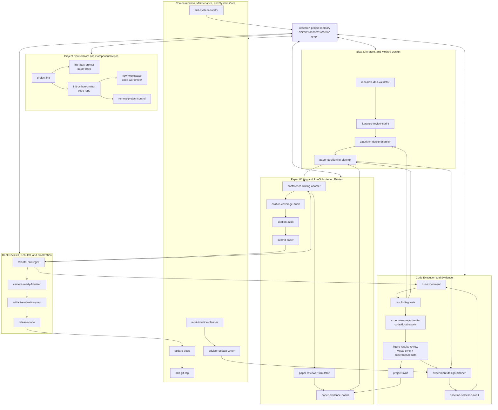

# ml-research-skills

Agent skills for the full ML research workflow: initializing paper and code repos, running experiments, syncing results, updating docs, checking paper readiness, preparing releases, and tagging milestones.

## Install

Install the full collection:

```bash
npx skills add a-green-hand-jack/ml-research-skills
```

Or install a specific skill:

```bash
npx skills add a-green-hand-jack/ml-research-skills --skill init-latex-project
npx skills add a-green-hand-jack/ml-research-skills --skill run-experiment
npx skills add a-green-hand-jack/ml-research-skills --skill remote-project-control
npx skills add a-green-hand-jack/ml-research-skills --skill submit-paper
```

Install globally for both Codex and Claude Code:

```bash
npx skills add a-green-hand-jack/ml-research-skills -g -a codex claude-code -y
```

Install one specific skill globally for both agents:

```bash
npx skills add a-green-hand-jack/ml-research-skills -g -a codex claude-code -s remote-project-control -y
```

With the default local setup used in this repo, Codex installs under `~/.agents/skills/` and Claude Code reads from `~/.claude/skills/`, often via symlinks created by `npx skills`.

## Skills

| Skill | What it does |
|---|---|
| `research-project-memory` | Initialize and maintain hierarchical project memory across claims, evidence, risks, actions, paper, code, worktrees, slides, reviews, and rebuttal |
| `research-idea-validator` | Turn a rough research idea into a pursue/revise/park/kill decision with novelty, feasibility, evidence, and reviewer-risk analysis |
| `literature-review-sprint` | Build a ranked literature map with canonical, closest, recent, baseline, and positioning implications for a topic or project direction |
| `algorithm-design-planner` | Turn a promising idea into a concrete method design with formulation, mechanism, assumptions, failure modes, ablations, and implementation handoff |
| `init-latex-project` | Scaffold a LaTeX academic paper project with venue-specific templates, macros, and official style files |
| `init-python-project` | Create or enhance a production-ready Python/ML code repo with four-layer architecture, code-side evidence docs, and remote-workflow memory scaffolding |
| `project-init` | Set up a research project control root with independent paper/code/slides repos, shared memory, root agent guidance, and code-owned worktree policy |
| `project-sync` | Sync experiment results from the code repo into the paper's `sections/daily_experiments.tex` log |
| `new-workspace` | Create a Git branch or project-aware code worktree for a new feature, experiment, baseline, debug task, or rebuttal fix |
| `experiment-design-planner` | Design hypothesis-driven experiments with baselines, ablations, metrics, controls, logging, and stop conditions before running |
| `baseline-selection-audit` | Audit whether experimental baselines are necessary, fair, current, and reviewer-proof before running or writing comparisons |
| `result-diagnosis` | Diagnose surprising, negative, unstable, or ambiguous experiment results and decide whether to debug, rerun, ablate, revise, narrow, write, park, or kill |
| `experiment-report-writer` | Write structured experiment reports from notes, configs, logs, metrics, tables, and figures, with setup, results, interpretation, limitations, and next steps |
| `advisor-update-writer` | Write decision-oriented advisor, mentor, lab meeting, or collaborator updates that connect evidence, risks, options, asks, and next actions |
| `figure-results-review` | Review figures, tables, plots, captions, result narratives, and paper visual style for claim support, visual clarity, statistical evidence, venue-facing consistency, and reviewer risk |
| `paper-evidence-board` | Maintain a paper-facing board aligning claims, evidence, figures, sections, reviewer risks, and next actions |
| `paper-positioning-planner` | Decide the paper's primary contribution, claim scope, archetype, target audience, novelty framing, and claims to avoid before venue-specific writing |
| `conference-writing-adapter` | Adapt an ML paper's structure, positioning, and paragraph-level writing to a target conference using venue exemplars and reusable writing memory |
| `paper-reviewer-simulator` | Simulate target-conference reviewers, predicted scores, likely reject reasons, meta-review, and a ranked pre-submission risk register |
| `rebuttal-strategist` | Analyze real reviews, infer reviewer intent, plan rebuttal experiments, draft responses, and track promised revisions |
| `camera-ready-finalizer` | Finalize an accepted paper by checking rebuttal promises, de-anonymization, final claims/evidence, supplement consistency, submission package, and release handoff |
| `artifact-evaluation-prep` | Prepare artifact evaluation packages, reviewer-facing reproduction instructions, smoke tests, manifests, and claim-to-artifact maps |
| `citation-coverage-audit` | Find missing classic, closest, benchmark, and recent concurrent citations before submission |
| `citation-audit` | Run a pre-submission audit of LaTeX citation keys, BibTeX entries, metadata, citation claims, labels, and references |
| `work-timeline-planner` | Build Markdown and/or HTML work timelines from git history, docs, and notes, with Mermaid or richer Gantt visualizations for review and planning |
| `safe-git-ops` | Perform common Git operations with sandbox-aware failure handling and worktree-safe diagnostics |
| `remote-project-control` | Recover project memory and safely coordinate local-to-remote SSH workflows for research repos |
| `run-experiment` | Generate reproducible local, SLURM, or RunAI job scripts and submission commands |
| `submit-paper` | Run a pre-submission checklist for a LaTeX paper, including anonymity, mandatory sections, and optional compile checks |
| `release-code` | Prepare a research code repository for public release with audit, README/LICENSE/CITATION, tagging, and optional GitHub release |
| `add-git-tag` | Create an annotated milestone tag with achievements and next-phase plans |
| `update-docs` | Detect changes since the last docs update and refresh only the affected documentation |
| `skill-system-auditor` | Audit the skill collection for inventory, lifecycle, routing, memory-writeback, documentation, and validation consistency |

## Lifecycle Categories

These skills are organized around the lifecycle of an ML research project: set up the workspace, run and summarize experiments, shape the paper for submission, handle review and rebuttal, then maintain or release the project.

### Skill Relationship Map

The collection is a feedback system, not a one-way pipeline. `research-project-memory` is the coordination layer; `project-init` creates the project control root; code-side skills produce evidence; paper-side skills select and present that evidence; review and rebuttal route failures back into experiments, writing, or positioning.



The most important feedback loops are:

- **Writing to experiments**: `paper-evidence-board` or `paper-reviewer-simulator` exposes a missing result, then routes back to `experiment-design-planner`, `baseline-selection-audit`, or `run-experiment`.
- **Results to project direction**: `result-diagnosis` can route a failed or surprising result back to `algorithm-design-planner` or `paper-positioning-planner`.
- **Code to paper**: `run-experiment` and `experiment-report-writer` create code-side evidence under `code/docs/`; `figure-results-review` checks claim support, captions, and visual style; `project-sync` and `paper-evidence-board` promote it into paper-facing evidence.
- **Reviews to revisions**: `rebuttal-strategist` routes real review issues into new experiments, writing changes, or final camera-ready promises.
- **Maintenance across the whole cycle**: `update-docs`, `add-git-tag`, `work-timeline-planner`, and `advisor-update-writer` are recurring skills, not only end-of-project tasks.

### 0. Project Memory and Coordination

Use this skill to keep feedback loops between idea, algorithm, experiments, writing, review, and rebuttal coherent across sessions:

| Skill | Lifecycle role |
|---|---|
| **research-project-memory** | Maintain hierarchical memory and claim-evidence-risk-action links across project components |

### 1. Idea Validation and Project Shaping

Use these skills when deciding whether an idea is worth pursuing and how it should become a research project:

| Skill | Lifecycle role |
|---|---|
| **research-idea-validator** | Judge a rough idea with the FIVE+C framework and choose pursue, revise, park, or kill |
| **literature-review-sprint** | Map canonical, closest, and recent work so novelty, baselines, gaps, and positioning are clear |
| **algorithm-design-planner** | Convert a promising idea into a concrete method, objective, architecture, or inference design |

### 2. Project Control Root and Component Repos

Use these skills when starting the project control root, creating or connecting component repos, or isolating a code line of work:

| Skill | Lifecycle role |
|---|---|
| **project-init** | Create the project control root with independent `paper/`, `code/`, optional `slides/`, shared `memory/`, root `AGENTS.md`, and `code-worktrees/` policy |
| **init-latex-project** | Scaffold the paper repo with venue-aware LaTeX structure |
| **init-python-project** | Scaffold or enhance the code repo with ML architecture, `docs/results/`, `docs/reports/`, `docs/runs/`, and remote workflow scaffolding |
| **new-workspace** | Create a branch or code worktree, defaulting to `code-worktrees/` under the project control root when applicable |
| **remote-project-control** | Coordinate local editing with remote execution on SSH/HPC environments |

### 3. Experiment Execution, Evidence Capture, and Research Updates

Use these skills while producing the evidence that will support the paper:

| Skill | Lifecycle role |
|---|---|
| **experiment-design-planner** | Design hypotheses, baselines, ablations, controls, metrics, and stop conditions before running |
| **baseline-selection-audit** | Convert claims and literature into must-have, should-have, optional, and excluded baselines with fairness rules |
| **run-experiment** | Launch reproducible local, SLURM, or RunAI experiment jobs |
| **result-diagnosis** | Diagnose unexpected or ambiguous results and decide the next project action |
| **experiment-report-writer** | Turn logs, metrics, configs, tables, and figures into an interpretable report |
| **advisor-update-writer** | Convert current progress, evidence, risks, and blockers into decision-oriented advisor or lab updates |
| **figure-results-review** | Check whether figures, tables, captions, result narratives, and visual style support the intended paper claims |
| **project-sync** | Record experiment results from the code repo into the paper repo |

### 4. Paper Writing and Pre-Submission Review

Use these skills while turning results into a submission and reducing reviewer risk before the deadline:

| Skill | Lifecycle role |
|---|---|
| **paper-evidence-board** | Align paper claims, evidence, figures, visual style, sections, reviewer risks, and next actions |
| **paper-positioning-planner** | Decide what the paper is selling, to whom, with what evidence, and what it must not claim |
| **conference-writing-adapter** | Adapt structure, narrative, and paragraph-level writing to a target venue |
| **paper-reviewer-simulator** | Simulate target-conference reviewers and rank likely rejection risks |
| **citation-coverage-audit** | Find missing classic, closest, benchmark, and recent concurrent citations |
| **citation-audit** | Verify existing citation keys, BibTeX metadata, references, and citation claims |
| **submit-paper** | Run final submission readiness checks for format, anonymity, required sections, and compilation |

### 5. Review, Rebuttal, and Revision

Use this stage after real reviews arrive:

| Skill | Lifecycle role |
|---|---|
| **rebuttal-strategist** | Analyze reviews, infer reviewer intent, plan rebuttal experiments, draft responses, and track promised revisions |

### 6. Camera-Ready and Finalization

Use this stage after acceptance and before final upload or public release:

| Skill | Lifecycle role |
|---|---|
| **camera-ready-finalizer** | Close rebuttal promises, de-anonymize, lock final claims/evidence, audit supplement consistency, and prepare release handoff |
| **artifact-evaluation-prep** | Package reviewer-facing reproduction instructions, smoke tests, data/checkpoint manifests, and claim-to-artifact maps |

### 7. Maintenance, Release, and Retrospective

Use these skills to keep the project understandable, publishable, and easy to hand off:

| Skill | Lifecycle role |
|---|---|
| **update-docs** | Refresh documentation after meaningful code or workflow changes |
| **release-code** | Prepare a public research code release with repo hygiene, README, license, citation, and tagging |
| **skill-system-auditor** | Audit the skill collection itself for lifecycle, routing, memory, documentation, and validation consistency |
| **work-timeline-planner** | Summarize past work or plan future work from git history, docs, and notes |
| **add-git-tag** | Mark a milestone with an annotated git tag |

### 8. Git Safety

Use this whenever a workflow touches non-trivial Git state:

| Skill | Lifecycle role |
|---|---|
| **safe-git-ops** | Diagnose and perform Git operations safely, especially around worktrees, conflicts, and sandboxed metadata writes |

## Role-Based Categories

The same skills can also be viewed by research role. A single researcher may switch between these roles during a project, but the classification helps choose the right skill for the job at hand.

### Experiment Runner

For the person running experiments, collecting evidence, and making results reproducible:

| Skill | Role support |
|---|---|
| **research-project-memory** | Track evidence, risks, actions, and worktree state across experiment feedback loops |
| **experiment-design-planner** | Convert a claim into a runnable experiment matrix with controls and decision rules |
| **baseline-selection-audit** | Decide which baselines must be run, how to make them fair, and which exclusions are defensible |
| **run-experiment** | Launch local, SLURM, or RunAI experiments with reproducible job scripts |
| **result-diagnosis** | Decide whether a result means debug, rerun, ablate, revise method, narrow claim, write, park, or kill |
| **experiment-report-writer** | Turn raw logs, metrics, tables, and figures into readable experiment reports |
| **advisor-update-writer** | Summarize experiment progress, blockers, and decision requests for advisors or collaborators |
| **figure-results-review** | Audit plots, tables, captions, and visual style before they become paper, slide, or advisor-facing evidence |
| **project-sync** | Move experiment findings into the paper repo's experiment log |
| **remote-project-control** | Keep local code and remote execution state aligned |

### Paper Writer

For the person turning research evidence into a submission:

| Skill | Role support |
|---|---|
| **research-project-memory** | Keep paper claims, evidence, figures, sections, and risks aligned |
| **paper-evidence-board** | Build and update the paper-facing claim/evidence/figure/section/risk board |
| **figure-results-review** | Verify that result visuals, captions, tables, and style conventions support the exact paper claims |
| **paper-positioning-planner** | Choose the primary paper story, contribution hierarchy, claim scope, and related-work boundary |
| **baseline-selection-audit** | Ensure comparison tables support the paper's claims and baseline exclusions are explainable |
| **conference-writing-adapter** | Shape the paper around target-conference writing expectations |
| **citation-coverage-audit** | Find missing classic, close, benchmark, and concurrent citations |
| **citation-audit** | Verify citation correctness, BibTeX metadata, and LaTeX references |
| **submit-paper** | Check final submission readiness |

### Reviewer / Internal Critic

For the person stress-testing the paper before reviewers see it:

| Skill | Role support |
|---|---|
| **research-project-memory** | Link simulated reviewer risks to claims, evidence gaps, and concrete actions |
| **paper-evidence-board** | Convert reviewer risks into paper locations, evidence gaps, and fix actions |
| **paper-reviewer-simulator** | Simulate venue-specific reviewers, predicted scores, likely reject reasons, and meta-review dynamics |
| **figure-results-review** | Catch visual-style, statistical, caption, and claim-support weaknesses before reviewers do |
| **paper-positioning-planner** | Detect when the paper is selling the wrong claim or should change archetype before review |
| **baseline-selection-audit** | Stress-test missing, weak, unfair, or outdated baseline comparisons before reviewers do |
| **citation-coverage-audit** | Detect missing related work that reviewers are likely to complain about |
| **citation-audit** | Check whether cited papers actually support the text's claims |

### Rebuttal Lead

For the person coordinating author response after real reviews arrive:

| Skill | Role support |
|---|---|
| **research-project-memory** | Link real review issues to rebuttal actions, promised revisions, and updated evidence |
| **rebuttal-strategist** | Parse reviews, infer reviewer intent, prioritize issues, plan rebuttal experiments, draft responses, and track promised revisions |
| **camera-ready-finalizer** | Verify that accepted-paper revisions fulfill rebuttal promises and close residual review risks |
| **run-experiment** | Execute targeted rebuttal experiments or analyses |
| **conference-writing-adapter** | Turn accepted reviewer criticism into paper revisions |

### Project Maintainer / Release Owner

For the person keeping the repo usable, documented, and publishable:

| Skill | Role support |
|---|---|
| **research-project-memory** | Maintain project-level status, decisions, actions, component memory, and closeout summaries |
| **camera-ready-finalizer** | Produce the final paper closeout and route code, artifact, upload, and milestone tasks |
| **artifact-evaluation-prep** | Prepare and validate artifact packages, reviewer instructions, and claim-to-artifact reproducibility maps |
| **advisor-update-writer** | Produce decision-oriented status updates for advisors, lab meetings, and collaborators |
| **update-docs** | Refresh docs after code or workflow changes |
| **release-code** | Prepare the public research code release |
| **skill-system-auditor** | Keep this skill collection coherent as new skills, categories, and routing rules are added |
| **add-git-tag** | Mark milestones with annotated tags |
| **work-timeline-planner** | Summarize work history or plan the next phase |
| **safe-git-ops** | Handle Git operations safely |

### Research Communicator

For the person translating project state into advisor, lab, or collaborator decisions:

| Skill | Role support |
|---|---|
| **research-project-memory** | Recover current project state, decisions, risks, actions, and feedback loops |
| **advisor-update-writer** | Write weekly updates, advisor emails, lab updates, meeting notes, and decision requests |
| **experiment-report-writer** | Provide detailed experiment reports that support the update |
| **figure-results-review** | Check figures or tables before they are shown in an update |
| **work-timeline-planner** | Summarize recent work when the update needs a timeline |

### Project Designer

For the person designing the overall research project, repo structure, and collaboration workflow:

| Skill | Role support |
|---|---|
| **research-project-memory** | Define memory layout and component ownership for the full project |
| **research-idea-validator** | Decide whether a rough idea should become a project and what must change before investing |
| **literature-review-sprint** | Establish the literature map, closest-work risk, baseline expectations, and open gap before method design |
| **algorithm-design-planner** | Define the method design before implementation and experiment planning |
| **project-init** | Create the project control root and connect paper, code, slides, memory, review, rebuttal, artifact, and code-worktree policy |
| **init-latex-project** | Define the paper scaffold and venue template |
| **init-python-project** | Define the code repo structure, experiment-entry architecture, and code-side evidence docs |
| **new-workspace** | Isolate new code directions, experiments, baselines, or rebuttal fixes with branches or code worktrees |
| **remote-project-control** | Establish local/remote execution conventions |

### Algorithm / Research Idea Designer

This role covers the earliest technical design work: decide whether an idea is worth pursuing, then turn it into a method that can be implemented and tested.

Current partial support:

| Skill | Role support |
|---|---|
| **research-project-memory** | Preserve idea, claim, evidence, risk, and action state across project pivots |
| **research-idea-validator** | Turn a rough idea into a pursue/revise/park/kill decision with novelty, feasibility, and paper-shape analysis |
| **literature-review-sprint** | Turn a topic or idea into a ranked paper map, closest-work comparison, baseline implications, and project-positioning decisions |
| **algorithm-design-planner** | Turn a promising idea into a method specification with assumptions, components, failure modes, ablations, and implementation handoff |
| **baseline-selection-audit** | Check whether the planned evidence compares against the right methods before the experiment matrix is fixed |
| **result-diagnosis** | Feed negative or surprising results back into algorithm design, project positioning, or claim revision |
| **figure-results-review** | Feed visualized results back into claim scope, evidence quality, and next experiment decisions |
| **paper-positioning-planner** | Convert idea, literature, method, and evidence into the paper's strategic claim and archetype |
| **experiment-design-planner** | Designs evidence for a claim once the rough idea exists |

The remaining useful hardening is mostly evaluation rather than new lifecycle coverage: end-to-end synthetic project tests, richer examples, and periodic skill-system audits.

## Typical Workflow

```text
1. research-project-memory -> initialize or recover hierarchical project memory and feedback-loop state
2. research-idea-validator -> decide whether a rough idea should be pursued, revised, parked, or killed
3. literature-review-sprint -> map canonical, closest, and recent work before locking project positioning
4. algorithm-design-planner -> turn the idea into a concrete method/objective/architecture design
5. project-init       -> create the project control root, memory, component repos, and code-worktree policy
6. new-workspace      -> isolate a code feature, experiment, baseline, debug task, or rebuttal fix
7. remote-project-control -> recover project memory and align local vs remote state
8. experiment-design-planner -> design baselines, ablations, metrics, and stop conditions
9. baseline-selection-audit -> verify must-have baselines, fairness, and reviewer-proof comparisons
10. run-experiment     -> launch locally or on SLURM / RunAI
11. result-diagnosis -> diagnose surprising/negative results and decide the next action
12. project-sync       -> record results in paper/sections/daily_experiments.tex
13. experiment-report-writer -> turn experiment evidence into a structured report
14. advisor-update-writer -> summarize progress, blockers, and decisions for an advisor or lab
15. figure-results-review -> audit figures, tables, captions, visual style, uncertainty, and claim support
16. paper-evidence-board -> align claims, evidence, figures, visual style, sections, risks, and actions
17. paper-positioning-planner -> decide paper archetype, primary claim, audience, and claims to avoid
18. conference-writing-adapter -> reshape the paper for a target venue's reviewer expectations
19. paper-reviewer-simulator -> simulate venue reviewers and rank likely rejection risks
20. citation-coverage-audit -> find missing classic, close, and concurrent citations
21. citation-audit  -> verify citations, BibTeX metadata, and LaTeX references before submission
22. submit-paper    -> run a readiness check before a deadline
23. rebuttal-strategist -> analyze real reviews and draft strategic rebuttals
24. camera-ready-finalizer -> finalize accepted paper, promises, metadata, supplement, and release handoff
25. artifact-evaluation-prep -> prepare reviewer-facing artifact instructions, smoke tests, and manifests
26. release-code    -> prepare the public code release when needed
27. work-timeline-planner -> summarize recent work or draft the next-phase timeline
28. update-docs     -> refresh docs after meaningful code changes
29. skill-system-auditor -> audit the skill collection for lifecycle and routing consistency
30. add-git-tag     -> mark a milestone
```

## What `research-project-memory` Provides

- Hierarchical project memory across `memory/`, component `.agent/` folders, and worktree status files
- Claim-evidence-risk-action tracking with stable IDs such as `CLM-001`, `EVD-001`, `RSK-001`, and `ACT-001`
- Templates for project boards: claims, evidence, risks, actions, decisions, current status, and component index
- Consistency checks for unsupported claims, stale evidence, reviewer risks without actions, rebuttal promises, and worktrees without exit conditions
- A shared writeback protocol for other skills after idea validation, experiment design, runs, writing, review simulation, and rebuttal
- Integration guidance in core research-loop skills so results, reviews, citations, rebuttals, and remote runs can update the same project memory graph

## What `research-idea-validator` Provides

- Early-stage idea validation using the FIVE+C framework: framing, importance, validity, evidence, execution, and competition
- A clear decision label: pursue, revise, park, or kill
- Paper-shape analysis for method, theory, benchmark, empirical analysis, systems, application, negative-result, and position-style ideas
- Minimum viable project, killer experiment or analysis, reviewer attack forecast, kill criteria, and next actions
- Memory guidance for preserving promising, parked, revised, or killed ideas across sessions

## What `literature-review-sprint` Provides

- A focused literature sprint for mapping canonical, closest, recent, concurrent, baseline, and positioning-relevant work
- A search protocol that records sources, queries, limitations, and verification status instead of hiding provenance
- Paper taxonomy and read/skim/defer prioritization based on project decision value
- Closest-work, baseline, evaluation, method, and positioning implications before algorithm or experiment design
- Project-memory writeback for literature-driven decisions, risks, actions, claim revisions, and planned evidence

## What `algorithm-design-planner` Provides

- A method-design workflow that turns a validated idea into a precise problem formulation, baseline modification, mechanism, objective, architecture, or inference procedure
- Assumption, invariant, failure-mode, complexity, and implementation-handoff checks before coding
- Ablation and diagnostic implications for every method component so the design can feed into `experiment-design-planner`
- Paper-method bridge guidance for algorithm boxes, equations, assumptions, and reviewer-facing explanations
- Project-memory writeback for design decisions, planned claims, risks, actions, and worktree exit conditions

## What `init-latex-project` Provides

- A complete LaTeX paper scaffold with `main.tex`, `macros.tex`, and a writing guide for agents
- Venue-specific templates for `icml`, `acl`, `emnlp`, `naacl`, `iccv`, `eccv`, `neurips`, `iclr`, `cvpr`, and `acm`
- Support for generic non-venue projects by using the default template without `--venue`
- A helper script that downloads official style files where needed and writes `venue_preamble.tex`

## What `init-python-project` Provides

- A four-layer ML project structure: `src/`, `experiments/`, `eval/`, and `infra/`
- Code-side evidence paths: `docs/results/`, `docs/reports/`, and `docs/runs/`
- `uv`-based Python project setup with editable installs
- Development tooling: pytest, black, ruff, and mypy
- Project docs scaffolding under `docs/`
- Remote workflow bootstrap files under `infra/remote-projects.yaml`, `docs/ops/`, and `.agent/`
- Editor configuration for Claude Code / Cursor / VS Code
- Guidance that `experiments/` is runnable logic, while raw outputs, logs, checkpoints, and wandb/tensorboard caches stay ignored or external

## What `project-init` Provides

- A project control root where agents can coordinate independent `paper/`, `code/`, optional `slides/`, `reviewer/`, `rebuttal/`, and `artifact/` components
- Root-level `PROJECT.md`, `AGENTS.md`, and `memory/` scaffolding for cross-component claim/evidence/risk/action management
- A default code worktree policy using sibling `code-worktrees/` rather than nested worktrees inside `code/`
- Clear separation between project-level memory, component repos, code-side evidence docs, and raw experiment artifacts

## What `new-workspace` Provides

- Branch and worktree creation for code features, experiments, baselines, debug tasks, and rebuttal fixes
- Project-aware worktree placement under `<ProjectName>/code-worktrees/` when the repo is `<ProjectName>/code/`
- Worktree-local evidence paths and `.agent/worktree-status.md` purpose/exit-condition memory
- UV environment sync, IDE config copying, and optional shared-asset symlinks through `.worktree-links`

## What `remote-project-control` Provides

- A repo-native memory model for projects developed locally but executed remotely over SSH
- Shared and private memory files for server mappings, working status, and local overrides
- Safe orchestration for inspect, sync, remote job submission, monitoring, and artifact lookup
- A clean handoff layer between project memory and `run-experiment`

## What `work-timeline-planner` Provides

- Evidence-based timeline synthesis from git commits, docs, notes, and user-provided chat excerpts
- Markdown and/or standalone HTML reports that can be kept privately or shared upward
- Mermaid Gantt charts for lightweight repo-native reports and richer HTML timelines when needed
- A clean split between observed work blocks and inferred or planned work

## What `experiment-report-writer` Provides

- A structured report format for experiment motivation, setup, methods, metrics, results, interpretation, conclusions, limitations, and next steps
- Guidance for explaining figures and tables, including axes, legends, units, scales, and error bars
- Evidence-first writing that distinguishes measured results from interpretation and marks missing reproducibility details
- Audience-aware output for lab notes, mentor updates, paper sections, or presentation-ready summaries

## What `advisor-update-writer` Provides

- Decision-oriented advisor, mentor, lab, and collaborator updates from project memory, reports, drafts, logs, and recent work
- Weekly, decision, meeting, email, and lab-update modes with explicit asks and next actions
- Evidence/risk/option framing that separates facts, interpretation, blockers, and recommendations
- Memory writeback for advisor decisions, action items, risks, and current project status after feedback

## What `figure-results-review` Provides

- A claim-support audit for figures, tables, plots, captions, and result prose before paper, slide, rebuttal, or advisor use
- Visual and table integrity checks for axes, labels, units, legends, row/column order, missing values, scales, and main-comparison salience
- Paper visual style policy checks for palette, marker and symbol mapping, typography, figure sizing, line widths, table conventions, and venue-facing consistency
- Statistical evidence checks for seeds, uncertainty, effect size, metric definitions, compute reporting, and efficiency claims
- Caption and narrative fixes that align setup, metric, comparison, takeaway, and caveat with the evidence
- Routed actions and project-memory writeback for reruns, result diagnosis, baseline audits, claim narrowing, caption rewrites, visual restyling, and figure/table edits

## What `result-diagnosis` Provides

- A post-result triage workflow for negative, surprising, unstable, conflicting, or suspicious experiment outcomes
- Diagnosis categories for implementation bugs, metric bugs, data issues, baseline fairness, seed variance, optimization, mechanism failure, scale/regime mismatch, and claim mismatch
- Decision rules for debug, rerun, ablate, revise-method, narrow-claim, write, park, or kill
- Evidence checklists covering provenance, configs, data splits, metrics, logs, figures, seeds, and baseline fairness
- Project-memory writeback for updated evidence, weakened claims, new risks, next actions, and worktree exit conditions

## What `paper-evidence-board` Provides

- A paper-facing claim/evidence matrix that links paper locations to experiments, figures, tables, citations, risks, and actions
- Section, figure/table, and visual-style maps so writing changes, stale results, inconsistent visuals, and unsupported claims are visible before submission
- Evidence-gap triage that routes issues to new experiments, result diagnosis, rewriting, claim narrowing, citation work, cutting, or accepted risk
- Reviewer-risk integration from simulated reviews, citation audits, result diagnosis, and real rebuttal issues
- Project-memory writeback for claim status, evidence status, paper locations, stale figures, reviewer risks, and paper actions

## What `paper-positioning-planner` Provides

- A strategic paper-positioning decision: lock, revise, narrow, change archetype, need evidence, or park
- Paper archetype selection across method, theory-guided method, empirical analysis, benchmark, systems, diagnostic, negative-result, and hybrid papers
- Primary/secondary contribution hierarchy with claims to keep, narrow, block, cut, or avoid
- Audience and venue-fit analysis with closest-work boundary, related-work scope, and novelty framing
- Paper-level narrative architecture for title direction, abstract skeleton, intro roles, main figure/table role, result ordering, and next-skill routing

## What `experiment-design-planner` Provides

- Claim-first experiment planning before using compute
- Hypothesis, alternative explanation, falsification, and decision-rule templates
- Baseline, control, nuisance-variable, metric, seed, repeat, and logging requirements
- Ablation matrix guidance for isolating components and avoiding multi-variable confounds
- Reviewer-risk checks that ask whether the planned evidence will satisfy paper or rebuttal expectations

## What `baseline-selection-audit` Provides

- A reviewer-facing baseline requirement audit with `must-have`, `should-have`, `optional`, `not-comparable`, and `citation-only` labels
- A baseline taxonomy that separates direct competitors, strongest current methods, standard benchmark baselines, classics, ablations, controls, oracle references, and resource-matched comparisons
- Fairness ledgers for data, model capacity, compute, tuning budget, protocol, metrics, implementation, and reporting units
- Reviewer attack forecasts for missing, weak, unfair, outdated, or overclaimed comparisons
- Experiment-design handoff and project-memory writeback for baseline risks, planned evidence, narrowed claims, and run/justify actions

## What `conference-writing-adapter` Provides

- Conference-aware paper restructuring for venues such as NeurIPS, ICML, ICLR, CVPR, ACL, and EMNLP
- A workflow for learning from accepted, oral, spotlight, or best-paper exemplars without copying their text
- Paper archetype diagnosis for method, empirical study, benchmark, theory, systems, analysis, and application papers
- Section-level and paragraph-level rewrite blueprints that assign each paragraph a reviewer-facing function
- Project-local writing memory under `.agent/conference-writing/` for venue patterns, exemplar notes, and current-paper style decisions

## What `paper-reviewer-simulator` Provides

- Venue-specific shadow reviews for ML/AI conferences such as NeurIPS, ICML, ICLR, CVPR, ACL, and EMNLP
- Dynamic learning from official reviewer guidelines, OpenReview discussions, example reviews, and accepted-paper patterns
- Multi-reviewer panels with technical, skeptical generalist, empirical/reproducibility, related-work, and area-chair perspectives
- Predicted decision, score/confidence estimates, likely reviewer questions, rebuttal readiness, and an actionable risk register
- Project-local memory under `.agent/reviewer-simulator/` for venue review patterns, example notes, and current-paper risks

## What `rebuttal-strategist` Provides

- OpenReview-aware review extraction, thread state tracking, and source logging for real reviews and discussion rounds
- Reviewer intent analysis that distinguishes champions, persuadable reviewers, skeptical reviewers, and likely rejects
- Issue boards that turn review comments into ranked must-win, must-answer, experiment-needed, and paper-revision tasks
- Targeted rebuttal experiment planning with success, partial-success, failure, and out-of-scope response wording
- Evidence-first rebuttal drafting, follow-up reply preparation, decision-path analysis, and promised-revision tracking
- Project-local memory under `.agent/rebuttal-strategy/` for reviews, issue boards, experiments, drafts, and final outcomes

## What `camera-ready-finalizer` Provides

- A post-acceptance finalization workflow for accepted papers, distinct from pre-submission `submit-paper`
- Rebuttal-promise ledgers that verify promised experiments, clarifications, citations, limitations, and fixes are fulfilled or explicitly resolved
- De-anonymization checks for authors, affiliations, acknowledgements, funding, self-citations, code links, project pages, and metadata
- Final claim/evidence locking across main paper, figures, tables, appendix, supplement, bibliography, and code/artifact links
- Release and artifact handoff for `release-code`, `artifact-evaluation-prep`, `citation-audit`, `submit-paper`, and milestone tagging

## What `artifact-evaluation-prep` Provides

- Reviewer-facing artifact evaluation package planning for code, data, checkpoints, scripts, expected outputs, and runtime budgets
- Claim-to-artifact maps that distinguish full runs, reduced runs, cached outputs, manual inspection, and out-of-scope claims
- Artifact manifests, quickstart instructions, smoke-test expectations, troubleshooting notes, and venue-rule verification guidance
- Handoff to camera-ready, release, reproducibility, and project memory workflows

## What `citation-coverage-audit` Provides

- A pre-submission scan for missing foundational classics, closest prior work, direct competitors, benchmark/data/metric sources, and recent concurrent papers
- Search protocols for arXiv, OpenReview, proceedings, ACL Anthology, PMLR, CVF, Semantic Scholar, DBLP, and venue-specific sources
- Risk classification for missing citations that could undermine novelty, baselines, theory claims, or related work coverage
- Suggested insertion points and novelty-framing changes for must-cite and should-cite papers
- Project-local memory under `.agent/citation-coverage/` for topic citation maps, search dates, and intentionally excluded papers

## What `citation-audit` Provides

- Local deterministic checks for LaTeX `\cite{}` keys, BibTeX entries, duplicate keys, labels, and cross-references
- Metadata verification guidance for DOI, arXiv, OpenReview, proceedings, publisher, and venue information
- Citation-claim auditing to check whether cited papers actually support nearby prose
- A pre-submission report format that separates blocking issues, important issues, warnings, and unresolved author decisions

## What `run-experiment` Provides

- Reproducible job templates under `jobs/` for local runs, SLURM clusters, and RunAI/Kubernetes
- A shared `environments.yaml` registry for cluster-specific defaults
- Built-in support for:
  - `local`
  - `ibex` (KAUST SLURM)
  - `uw` (placeholder SLURM profile to customize)
  - `runai` (EPFL RunAI / Kubernetes)

## What `submit-paper` Checks

- Submission mode in `venue_preamble.tex`
- Drafting artifacts such as TODOs and comment macros
- Venue-specific required sections and bibliography presence
- Basic anonymity issues for blind review
- Optional compile checks and page-count sanity checks

## What `release-code` Provides

- A release audit for secrets, large files, and missing repo hygiene
- Templates for `README.md` and `CITATION.cff`
- License generation guidance
- A structured tagging and publishing flow for public code releases

## What `skill-system-auditor` Provides

- Global skill-collection audits for inventory, lifecycle coverage, role categories, routing, memory writeback, documentation drift, and stale future-skill references
- A reusable process for deciding whether a missing capability is a real gap, covered by an existing skill, out of scope, or hardening work
- Documentation sync checks across README, AGENTS, CLAUDE, memory protocols, and audit reports
- Validation-first maintenance guidance before committing, pushing, or reinstalling the skill collection

## Contributors

- Jieke
- Claude Code
- Codex

## Validation

There are no automated tests in this repository. For a quick repository sanity check, run:

```bash
python3 scripts/validate_skills.py
```

This validator checks frontmatter parsing, skill-directory name alignment, helper-file references, hardcoded Claude-only skill paths, text-template placeholder format, skill inventory consistency in the top-level docs, and basic Python/shell syntax for helper scripts.

For the `init-python-project` scaffold smoke test, run:

```bash
python3 -m unittest -v tests.test_init_python_project_scaffold
```

To validate a skill end-to-end:

1. Install the skill into the target agent runtime with `npx skills add`, for example `npx skills add a-green-hand-jack/ml-research-skills -g -a codex claude-code -s <skill-name> -y`
2. Invoke it in the corresponding agent with a matching request
3. Inspect the generated files, commands, or instructions and iterate

## Requirements

- [Claude Code](https://claude.ai/code) or another compatible agent runtime
- [npx skills](https://github.com/vercel-labs/skills)
- For Python-related skills: [uv](https://docs.astral.sh/uv/)
- For LaTeX-related skills: a TeX distribution such as TeX Live or MiKTeX
