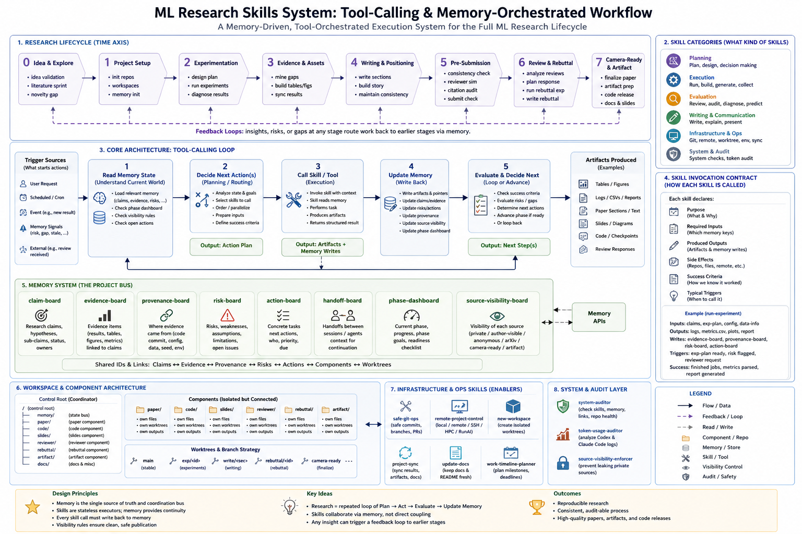
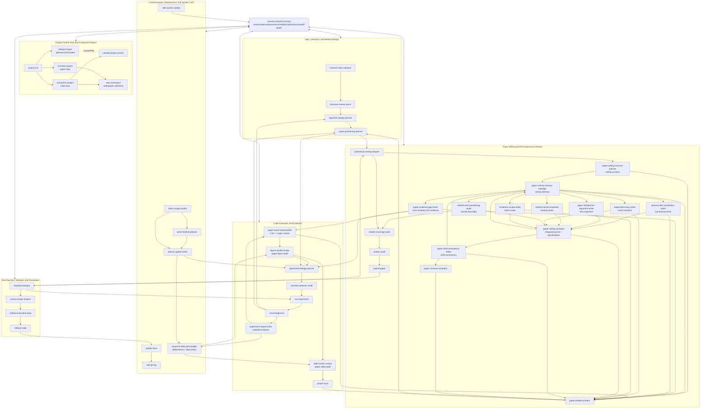

# ml-research-skills

Agent skills for the full ML research workflow: initializing paper and code repos, running experiments, syncing results, updating docs, checking paper readiness, preparing releases, and tagging milestones.



## Install

Install the full collection:

```bash
npx skills add a-green-hand-jack/ml-research-skills
```

Or install a specific skill:

```bash
npx skills add a-green-hand-jack/ml-research-skills --skill init-latex-project
npx skills add a-green-hand-jack/ml-research-skills --skill run-experiment
npx skills add a-green-hand-jack/ml-research-skills --skill remote-project-control
npx skills add a-green-hand-jack/ml-research-skills --skill submit-paper
```

Install globally for both Codex and Claude Code:

```bash
npx skills add a-green-hand-jack/ml-research-skills -g -a codex claude-code -y
```

Install one specific skill globally for both agents:

```bash
npx skills add a-green-hand-jack/ml-research-skills -g -a codex claude-code -s remote-project-control -y
```

With the default local setup used in this repo, Codex installs under `~/.agents/skills/` and Claude Code reads from `~/.claude/skills/`, often via symlinks created by `npx skills`.

## Skills

| Skill | What it does |
|---|---|
| `research-project-memory` | Initialize and maintain hierarchical project memory across claim lifecycle, evidence provenance, source visibility, risks, actions, handoffs, phase dashboard, paper, code, worktrees, slides, reviews, and rebuttal |
| `research-idea-validator` | Turn a rough research idea into a pursue/revise/park/kill decision with novelty, feasibility, evidence, and reviewer-risk analysis |
| `literature-review-sprint` | Build a ranked literature map with canonical, closest, recent, baseline, and positioning implications for a topic or project direction |
| `algorithm-design-planner` | Turn a promising idea into a concrete method design with formulation, mechanism, assumptions, failure modes, ablations, and implementation handoff |
| `init-latex-project` | Scaffold a LaTeX academic paper project with venue-specific templates, macros, and official style files |
| `init-python-project` | Create or enhance a production-ready Python/ML code repo with four-layer architecture, `uv`/`ruff`/`mypy`/`pytest`/`pre-commit` gates, code-side evidence docs, and remote-workflow memory scaffolding |
| `project-init` | Set up a research project control root with independent paper/code/slides repos, shared memory, root project docs, optional GitHub Project board linkage, root agent guidance, and code/paper worktree policy |
| `project-sync` | Sync experiment results from the code repo into the paper's `sections/daily_experiments.tex` log |
| `new-workspace` | Create a Git branch or project-aware worktree for code experiments, baselines, rebuttal fixes, paper venue versions, arXiv releases, or camera-ready paper versions |
| `code-reviewer` | Run fresh-context code reviews from `.agent/code-reviews/` bundles using one-shot Codex/Claude Code reviewer sessions so core implementations can be audited without sharing the writer's chat context |
| `experiment-design-planner` | Design hypothesis-driven experiments with baselines, ablations, metrics, controls, logging, and stop conditions before running |
| `baseline-selection-audit` | Audit whether experimental baselines are necessary, fair, current, and reviewer-proof before running or writing comparisons |
| `result-diagnosis` | Diagnose surprising, negative, unstable, or ambiguous experiment results and decide whether to debug, rerun, ablate, revise, narrow, write, park, or kill |
| `experiment-report-writer` | Write structured experiment reports from notes, configs, logs, metrics, tables, and figures, with setup, results, interpretation, limitations, and next steps |
| `advisor-update-writer` | Write decision-oriented advisor, mentor, lab meeting, or collaborator updates that connect evidence, risks, options, asks, and next actions |
| `research-slide-deck-builder` | Design and write research slide decks for advisor, lab, progress, reading, proposal, and conference talks using the external `progress-slides` template |
| `figure-results-review` | Review figure assets, LaTeX figure wrappers, plots, captions, visual descriptions, and paper visual style for claim support and reviewer risk |
| `table-results-review` | Review standalone `tables/*.tex` files, table captions, table descriptions, row/column semantics, numeric provenance, and experiment settings |
| `paper-evidence-board` | Maintain a paper-facing board aligning claims, evidence, figures, sections, reviewer risks, and next actions |
| `paper-evidence-gap-miner` | Mine existing CSV results, logs, reports, and assets to fill claim evidence gaps before planning new compute |
| `paper-result-asset-builder` | Build paper-facing tables, figures, wrappers, inventories, and provenance records from CSV experiment outputs |
| `paper-writing-memory-manager` | Maintain dynamic writing memory across nonlinear drafting sessions, section status, dependencies, style decisions, edit impact, stale prose, and open writing threads |
| `paper-positioning-planner` | Decide the paper's primary contribution, claim scope, archetype, target audience, novelty framing, and claims to avoid before venue-specific writing |
| `conference-writing-adapter` | Adapt an ML paper's structure, positioning, and paragraph-level writing to a target conference using venue exemplars and reusable writing memory |
| `abstract-title-contribution-writer` | Draft and revise titles, abstracts, and contribution lists so the paper's top-level promise matches venue, positioning, claims, and evidence |
| `experiment-story-writer` | Turn experiment tables, figures, ablations, mixed results, and provisional metrics into claim-aware results prose |
| `limitations-scope-writer` | Plan, draft, and revise limitations, scope, failure cases, ethics, broader impact, and conclusion caveats as claim-boundary control |
| `method-section-explainer` | Plan, draft, and revise method sections for notation flow, module ordering, overview figures, algorithm boxes, design rationales, and appendix boundaries |
| `paper-draft-consistency-editor` | Audit and edit a paper draft for internal consistency across title, abstract, intro, method, results, figures, tables, captions, terminology, limitations, and conclusion |
| `paper-introduction-argument-writer` | Plan, draft, and revise introductions as venue-aware argument chains with hook, gap, insight, method, evidence, and contribution paragraph roles |
| `paper-writing-contract-planner` | Create or update a writing contract that locks paper archetype, section order, paragraph roles, claim evidence slots, figure/table jobs, and forbidden claims before drafting |
| `paper-writing-assistant` | Draft and revise claim-aware paper prose, map archetypes to required evidence slots, use micro-patterns for captions and paragraph-level writing, and track provisional result placeholders until verified evidence arrives |
| `related-work-positioning-writer` | Plan, draft, and revise related work as novelty-boundary writing, grouping closest work and defining safe citation-backed boundary statements |
| `paper-reviewer-simulator` | Simulate target-conference reviewers, predicted scores, likely reject reasons, meta-review, and a ranked pre-submission risk register |
| `rebuttal-strategist` | Analyze real reviews, infer reviewer intent, plan rebuttal experiments, draft responses, and track promised revisions |
| `camera-ready-finalizer` | Finalize an accepted paper by checking rebuttal promises, de-anonymization, final claims/evidence, supplement consistency, submission package, and release handoff |
| `artifact-evaluation-prep` | Prepare artifact evaluation packages, reviewer-facing reproduction instructions, smoke tests, manifests, and claim-to-artifact maps |
| `citation-coverage-audit` | Find missing classic, closest, benchmark, and recent concurrent citations before submission |
| `citation-audit` | Run a pre-submission audit of LaTeX citation keys, BibTeX entries, metadata, citation claims, labels, and references |
| `work-timeline-planner` | Build Markdown and/or HTML work timelines from git history, docs, and notes, with Mermaid or richer Gantt visualizations for review and planning |
| `token-usage-auditor` | Audit project token usage from local Codex and Claude Code logs, separating total context, fresh token burn, cache reuse, sessions, and lifecycle interpretation |
| `safe-git-ops` | Perform common Git operations with sandbox-aware failure handling and worktree-safe diagnostics |
| `remote-project-control` | Recover project memory and safely coordinate local, Git remote, and SSH/HPC/RunAI server workflows for research repos |
| `run-experiment` | Generate reproducible local, SLURM, or RunAI job scripts and submission commands |
| `submit-paper` | Run a pre-submission checklist for a LaTeX paper, including anonymity, mandatory sections, source formatting, and optional compile checks |
| `release-code` | Prepare a research code repository for public release with audit, README/LICENSE/CITATION, tagging, and optional GitHub release |
| `add-git-tag` | Create an annotated milestone tag with achievements and next-phase plans |
| `update-docs` | Detect changes since the last docs update and refresh only the affected documentation |
| `skill-system-auditor` | Audit the skill collection for inventory, lifecycle, routing, memory-writeback, documentation, and validation consistency |

## Project Anatomy

This section describes the static shape of a research project managed by these skills. It is different from the lifecycle map below: the lifecycle map explains how skills call each other over time, while this view explains where artifacts live and which skills mainly operate in each area.

### Control Root

A full project is a control root with independent component repositories:

```text
<ProjectName>/
├── PROJECT.md              # human overview and component boundaries
├── AGENTS.md               # universal/Codex root guidance for agents
├── CLAUDE.md               # Claude Code root guidance, aligned with AGENTS.md
├── memory/                 # durable cross-component state
│   ├── project.yaml
│   ├── component-index.yaml
│   ├── current-status.md
│   ├── decision-log.md
│   ├── claim-board.md
│   ├── evidence-board.md
│   ├── provenance-board.md
│   ├── risk-board.md
│   ├── action-board.md
│   ├── handoff-board.md
│   ├── phase-dashboard.md
│   └── source-visibility-board.md
├── docs/                   # project-level docs, not code-side run archives
│   ├── overview.md
│   ├── designs/
│   ├── experiments/
│   ├── updates/
│   ├── audits/
│   └── timelines/
├── paper/                  # independent LaTeX paper repo
├── code/                   # independent Python/ML code repo
├── code-worktrees/          # sibling worktrees for code repo branches
├── paper-worktrees/         # sibling worktrees for paper venue/arXiv/camera-ready versions
├── slides/                 # optional independent multi-deck slides repo
│   ├── slides.md            # optional active/default deck or template staging file
│   ├── decks/               # stable advisor/lab/result/rebuttal/conference decks
│   ├── assets/              # shared or deck-specific slide assets
│   └── .agent/
│       ├── slides-status.md
│       ├── deck-index.md
│       └── decks/
├── reviewer/               # simulated review state
├── rebuttal/               # real review and response state
└── artifact/               # artifact evaluation and release handoff state
```

Root ownership rules:

- `<ProjectName>/` is the coordination layer. It stores project memory, cross-component plans, and handoffs.
- `paper/`, `code/`, and `slides/` are component repos. Use `git -C paper ...`, `git -C code ...`, and `git -C slides ...`.
- Do not put experiment outputs directly under the root. Runnable code, run records, results, and logs belong under `code/` or a code worktree.
- Do not create paper version folders inside `paper/`. Venue submissions, arXiv releases, and camera-ready versions belong under `paper-worktrees/`.
- Do not treat `slides/slides.md` as the whole presentation history. Stable meeting/talk decks belong under `slides/decks/`, with deck registry memory in `slides/.agent/deck-index.md`.
- Root `memory/` stores durable summaries and links. It should point to detailed evidence rather than duplicate raw logs, full tables, or full paper prose.
- Root `memory/` also owns the system-level protocols: claim lifecycle, evidence provenance, cross-module handoffs, and the project phase dashboard.
- Root `memory/source-visibility-board.md` tracks which paper source surfaces are agent-private, author-visible, submission-visible, arXiv/public, camera-ready, or publisher/artifact-visible.
- Cross-worktree memory has three layers: global registry in `memory/component-index.yaml`, component rollups in `paper/.agent/worktree-index.md` and `code/.agent/worktree-index.md`, and leaf status in each worktree's `.agent/worktree-status.md`.

Optional GitHub Project alignment:

- A GitHub Project is the cloud planning board for one research project, not a replacement for the control root or any component repo.
- Use one GitHub Project per research project when the work spans several repos, such as root, code, paper, and slides.
- Link repo issues and PRs from the component repos into the same GitHub Project. Keep durable research memory in `memory/`; keep actionable, collaborator-facing work in GitHub issues/PRs/project items.
- Recommended fields: `Component`, `Workstream`, `Status`, `Priority`, `Target`, `Claim ID`, `Evidence ID`, `Worktree`, and `Blocker`.
- Recommended views: `Roadmap`, `Board`, `Experiments`, `Paper`, `Risks`, and `Worktrees`.
- With `gh`, GitHub Projects require a token with the `project` scope. Use `gh auth refresh -s project` before `gh project ...` commands when the scope is missing.

Primary skills by root area:

| Area | Main artifacts | Primary skills |
|---|---|---|
| Root setup | `PROJECT.md`, paired root `AGENTS.md`/`CLAUDE.md`, component repos, root docs | **project-init**, **research-project-memory** |
| Root memory | claims, evidence, provenance, risks, actions, handoffs, phase dashboard, source visibility, decisions, component index | **research-project-memory**, **paper-evidence-board**, **project-sync** |
| Root planning docs | designs, experiment plans, audits, updates, timelines | **algorithm-design-planner**, **experiment-design-planner**, **advisor-update-writer**, **work-timeline-planner** |
| Git and worktree policy | component remotes, code worktrees, paper worktrees, milestone tags | **safe-git-ops**, **new-workspace**, **add-git-tag** |
| Cloud coordination | GitHub Project board, repo issues, PRs, public task status | **project-init**, **remote-project-control**, **safe-git-ops** |

### Memory System

The memory system is the project bus that lets independent skills act coherently across sessions. A skill should not only finish its immediate task; when it changes project state, it should leave a small, durable pointer so the next skill can pick up the claim, evidence, risk, action, component, or worktree that changed.

Memory is layered:

| Layer | Location | Purpose | Examples |
|---|---|---|---|
| Project memory | `memory/` | Shared coordination state across paper, code, slides, review, rebuttal, artifact, and worktrees | `project.yaml`, `component-index.yaml`, `claim-board.md`, `evidence-board.md`, `provenance-board.md`, `risk-board.md`, `action-board.md`, `handoff-board.md`, `phase-dashboard.md`, `source-visibility-board.md` |
| Cloud coordination | GitHub Project | Optional collaborator-facing task board across component repos | issues, PRs, draft items, roadmap/board/table views, custom fields |
| Component memory | `<component>/.agent/` | Component-local state that is too detailed for root boards but still useful across sessions | `paper/.agent/paper-status.md`, `paper/.agent/figure-table-map.md`, `code/.agent/worktree-index.md`, `slides/.agent/deck-index.md` |
| Repo-native ops memory | `code/docs/ops/` and similar component docs | Operational notes native to a repo; useful but not a cross-component registry | `code/docs/ops/current-status.md`, `code/docs/ops/decision-log.md` |
| Worktree memory | `<component-worktree>/.agent/worktree-status.md` | Leaf state for one experimental branch or paper version | purpose, branch, linked claims, latest result, source visibility, exit condition |

The stable object graph uses IDs:

```text
CLM-001 -> supported_by EVD-003 -> traced_by PRV-002 -> visualized_by FIG-002 -> threatened_by RSK-004 -> resolved_by ACT-007
                      \-> produced_by EXP-002 on WTR-005
HND-004 -> transfers EVD-003 from code report to paper-result-asset-builder
```

This graph is what connects skills:

The four system-level protocols are:

| Protocol | Memory surface | Purpose |
|---|---|---|
| Claim lifecycle | `memory/claim-board.md` | Tracks each claim from `idea` / `planned` through `evidence-needed`, `provisional`, `supported`, `revised`, `cut`, or `final` |
| Evidence provenance | `memory/provenance-board.md` | Traces raw runs, CSVs, reports, analyses, citations, figures, tables, captions, and result prose back to source evidence |
| Project phase dashboard | `memory/phase-dashboard.md` | Gives the global project-cycle phase, active gate, readiness, stale objects, and next session entry point |
| Cross-module handoff contracts | `memory/handoff-board.md` | Makes producer/consumer payloads explicit when work moves between idea, method, code, paper, slides, review, rebuttal, artifact, or release modules |
| Paper source visibility | `memory/source-visibility-board.md` | Separates agent-private, author-visible/Overleaf, anonymous submission, arXiv/public, camera-ready, and publisher/artifact source surfaces |

| Skill family | Reads from memory | Writes back |
|---|---|---|
| Idea, literature, method | existing claims, decisions, risks, target venue | scoped claims, novelty risks, method decisions, planned actions |
| Experiment planning and baselines | claims, risks, required evidence, prior decisions | experiment families, baseline policy, falsification actions |
| Run and diagnose experiments | worktree state, run plans, stale evidence | run pointers, evidence status, revised claims, next actions |
| Figure and table review | evidence board, provenance board, paper locations, visual/table map | figure/table status, caption actions, provenance risks |
| Paper writing and venue adaptation | claims, evidence, provenance, risks, target venue, phase dashboard, paper status | section mapping, claim wording decisions, writing risks, stale prose, handoffs |
| Submission, review, rebuttal, camera-ready | readiness state, reviewer risks, promised actions, phase dashboard | blockers, review issues, rebuttal promises, final release handoff |
| Slides and advisor updates | current status, evidence, risks, action board, deck index | advisor feedback, deck registry updates, presentation stale-evidence notes, next actions |

Cross-worktree memory has a stricter shape:

```text
memory/component-index.yaml
  -> code/.agent/worktree-index.md
      -> code-worktrees/<branch>/.agent/worktree-status.md
  -> paper/.agent/worktree-index.md
      -> paper-worktrees/<version>/.agent/worktree-status.md
```

When `new-workspace` creates, parks, merges, or kills a worktree, it should update the root registry, the component worktree index, and the leaf status file. This prevents a result in one code branch, an arXiv paper branch, and a camera-ready branch from drifting apart without a visible project-level record.

Slides deck memory is similar but deck-oriented rather than worktree-oriented:

```text
memory/component-index.yaml
  -> slides/.agent/slides-status.md
      -> slides/.agent/deck-index.md
          -> slides/.agent/decks/<deck-id>.md
          -> slides/decks/<deck-id>.md
```

When `research-slide-deck-builder` creates or materially changes a real meeting/talk deck, it should update the component status and deck index so old advisor, lab, rebuttal, and conference decks remain discoverable instead of being overwritten through `slides.md`.

Use certainty labels whenever memory may become stale:

- `observed`: verified from files, logs, command output, paper text, or review text
- `user-stated`: stated by the researcher
- `inferred`: agent inference that should be treated cautiously
- `stale`: was true earlier but may have changed
- `needs-verification`: must be checked before acting

Rule of thumb: root `memory/` stores durable coordination, component `.agent/` stores local rollups, repo-native docs store operational detail, and worktree status files store branch/version leaf state. Do not hide important cross-skill state only in a report, only in a paper comment, or only in a terminal transcript.

GitHub Project integration is deliberately narrower than project memory. Mirror only actionable work that benefits from GitHub visibility, such as issues, PRs, blockers, owner/status, and target dates. Do not use GitHub Project fields as the only copy of claim rationale, private reviewer-risk notes, experiment interpretation, arXiv source-cleanup policy, or detailed provenance.

### Project Toolchain Gates

Toolchain gates make project tools part of the lifecycle rather than optional agent habits. The default policy is check-before-mutate: run non-mutating checks automatically when they are cheap and available; run formatters or auto-fixers only when requested or required by project policy; review the diff after any mutating command.

Default code gates:

```bash
uv sync
uv run ruff format --check src tests experiments scripts
uv run ruff check src tests experiments scripts
uv run mypy src
uv run pytest tests -v
uv run pre-commit run --all-files
```

For non-ML or existing repos, omit paths that do not exist and preserve the repo's documented tools.

Use mutating code commands only after an explicit request or documented policy:

```bash
uv run ruff format src tests experiments scripts
uv run ruff check --fix src tests experiments scripts
```

`pre-commit` is the default local gate runner for mixed project hygiene. The scaffolded config checks Python gates plus optional tools when installed:

- `gitleaks` or `detect-secrets`: secret scanning before push/release
- `shellcheck` / `shfmt`: shell and job script lint/format checks
- `actionlint`: GitHub Actions workflow lint
- `nbstripout`: notebook output hygiene
- `taplo` / `yamllint`: TOML/YAML config hygiene
- `lychee`: README/docs link checking

Missing optional tools are reported as skipped unless project policy marks them required.

Default paper gates:

```bash
tex-fmt --check --nowrap --recursive .
bash <submit-paper-skill-dir>/scripts/check.sh "$PAPER_DIR"
```

Use `tex-fmt --nowrap --recursive .` only when formatting is requested or required, then review the diff. Paper compile truth still comes from Overleaf/GitHub or a local LaTeX compile log.

Default coordination gates include `git status --short --branch`, `git diff --check`, `gh auth status`, and PR/CI checks such as `gh pr checks` when GitHub is in use. `git` and `gh` are toolchain components too: `git` owns source history and worktree boundaries, while GitHub/GitHub Project owns collaborator-visible issues, PRs, release records, and board state.

Stable gate policy belongs in `memory/project.yaml` under `toolchain_gates`. Component-specific overrides belong in `code/AGENTS.md`, `paper/AGENTS.md`, component `.agent/` files, or worktree status files. Preserve existing healthy tools such as `black`, `isort`, `pyright`, `pre-commit`, `gitleaks`, `shellcheck`, `shfmt`, `actionlint`, or CI-specific commands instead of forcing the default scaffold tools.

### Paper Repo

The paper repo is the paper-facing source of truth: claims, narrative, figures, tables, captions, citations, submission mode, source visibility, and final PDF state.

```text
paper/
├── main.tex                 # paper entry point
├── venue_preamble.tex       # venue mode and style package hook
├── macros.tex               # shared math and author macros
├── AGENTS.md                # agent-private paper-local guidance; do not push to visible source by default
├── CLAUDE.md                # agent-private Claude Code guidance; aligned with AGENTS.md
├── .gitignore               # ignores agent/private files for visible paper source by default
├── sections/
│   ├── title.tex
│   ├── abstract.tex
│   ├── intro.tex
│   ├── related.tex
│   ├── method.tex
│   ├── exp.tex
│   ├── conclusion.tex
│   ├── appendix.tex
│   ├── acknowledgement.tex
│   └── <venue-required>.tex # e.g. impact, limitations, checklist
├── figures/
│   ├── fig_name.pdf         # rendered figure asset
│   ├── fig_name.png         # optional raster preview/export
│   └── fig_name.tex         # LaTeX wrapper: includegraphics, caption, label
├── tables/
│   └── table_name.tex       # standalone table wrapper and table source
├── bib/
│   └── refs.bib
└── .agent/                  # agent-private paper memory; do not push to visible source by default
    ├── visual-style.md
    ├── figure-table-map.md
    ├── writing-memory/
    │   ├── writing-state.md
    │   ├── section-ledger.md
    │   ├── dependency-map.md
    │   ├── edit-impact-log.md
    │   ├── style-and-terminology.md
    │   ├── open-writing-threads.md
    │   └── session-notes.md
    ├── writing-contract.md
    ├── evidence-completion-plan.md
    ├── result-inventory.md
    ├── result-asset-provenance.md
    ├── abstract-title-plan.md
    ├── introduction-plan.md
    ├── method-explanation-plan.md
    ├── experiment-story-plan.md
    ├── related-work-plan.md
    ├── limitations-scope-plan.md
    ├── consistency-report.md
    ├── provisional-results.md
    ├── worktree-index.md
    └── paper-status.md
```

Paper boundary rules:

- Sections hold paper prose. They should not become experiment logs.
- `figures/*.tex` wraps a rendered figure asset. The figure description, caption, and main-text callout are separate artifacts.
- `tables/*.tex` is the standalone table source/wrapper. The table description, caption, row/column semantics, and numeric provenance are separate artifacts.
- Local macOS does not need TeX Live. The default compile path can be local edit -> GitHub push -> Overleaf compile.
- If `tex-fmt` is installed, use `tex-fmt --check --nowrap --recursive .` as the default paper source-format gate. Run `tex-fmt --nowrap --recursive .` only when formatting is requested or required, then review the diff before push/submission.
- Paper-facing claims should be backed by evidence links in root `memory/` and, when needed, code-side reports under `code/docs/`.
- Different paper versions should use paper worktrees under `paper-worktrees/` when they need different templates, venue modes, anonymity rules, arXiv cleanup, or camera-ready edits.
- Paper source visibility is independent of venue. If `paper/main` syncs to Overleaf through GitHub, treat it as `author-visible`, not private.
- Author-visible, anonymous-submission, arXiv/public, camera-ready, and publisher-visible paper source must exclude `.agent/`, `AGENTS.md`, `CLAUDE.md`, raw CSVs, internal result docs, plotting scripts, notebooks, reviewer/rebuttal scratch, private paths, and agent-only provenance ledgers unless the user explicitly cleans and publishes them.
- Agent-private paper state belongs in root `memory/`, private component `.agent/`, untracked local files, or an `agent-private` paper worktree.
- arXiv/public-source worktrees must remove internal comments, figure/table descriptions in TeX comments, reviewer notes, TODOs, author-comment macros, and private paths from public source.
- Conference worktrees must enforce venue mode and anonymity. Camera-ready worktrees must de-anonymize, add acknowledgements/funding, and remove draft-only notes.

### LaTeX Source Formatting

This repository treats `tex-fmt` as the default LaTeX source formatter when it is available locally. It is a source hygiene gate, not a compile check.

Use check mode before submission, arXiv packaging, camera-ready cleanup, or pushing an author-visible Overleaf branch:

```bash
tex-fmt --check --nowrap --recursive .
```

Use format mode only when formatting is requested or required by project policy:

```bash
tex-fmt --nowrap --recursive .
```

Then review the diff before committing or pushing. The default policy uses `--nowrap` so routine formatting does not reflow prose lines in paper sections. If a paper repo has a project-local `tex-fmt` config, follow that config instead.

`tex-fmt` does not replace LaTeX compilation. Local macOS workflows can still rely on Overleaf/GitHub for compile logs, page count, overfull boxes, bibliography rendering, and final PDF inspection.

Primary skills in `paper/`:

| Paper area | Main artifacts | Primary skills |
|---|---|---|
| Paper scaffold | `main.tex`, `sections/`, `venue_preamble.tex`, `macros.tex` | **init-latex-project**, **submit-paper** |
| Paper story and claims | title, abstract, intro, method, experiments, limitations | **paper-positioning-planner**, **conference-writing-adapter**, **paper-writing-contract-planner**, **paper-writing-memory-manager**, **paper-evidence-gap-miner**, **abstract-title-contribution-writer**, **paper-introduction-argument-writer**, **method-section-explainer**, **experiment-story-writer**, **related-work-positioning-writer**, **limitations-scope-writer**, **paper-writing-assistant**, **paper-draft-consistency-editor**, **paper-evidence-board** |
| CSV-derived result assets | `result-inventory.md`, `result-asset-provenance.md`, paper-facing tables/figures | **paper-evidence-gap-miner**, **paper-result-asset-builder**, **paper-evidence-board** |
| Figures | `figures/*.pdf`, `figures/*.png`, `figures/*.tex` | **paper-result-asset-builder**, **figure-results-review**, **paper-evidence-board** |
| Tables | `tables/*.tex` | **paper-result-asset-builder**, **table-results-review**, **baseline-selection-audit**, **paper-evidence-board** |
| Citations | `bib/refs.bib`, citation claims, related-work coverage | **citation-coverage-audit**, **citation-audit** |
| Pre-submission | anonymity, required sections, mode, source formatting, compile state | **submit-paper**, **paper-reviewer-simulator** |
| Reviews and final paper | reviews, rebuttal promises, camera-ready state | **rebuttal-strategist**, **camera-ready-finalizer** |

### Paper Worktrees

Paper worktrees isolate paper versions without disturbing the main `paper/` branch:

```text
<ProjectName>/
├── paper/
└── paper-worktrees/
    ├── venue-neurips/
    ├── venue-icml/
    ├── arxiv-v1/
    └── camera-ready-neurips/
```

Use them when:

- retargeting the same project to a different conference template
- preparing an arXiv release with public source cleanup
- finalizing a camera-ready version after acceptance
- making paper-only rebuttal edits with a clear exit condition

Each paper worktree should have `.agent/worktree-status.md` recording target venue/release, submission mode, template/style differences, source visibility, cleanup requirements, compile workflow, and exit condition.

Paper source visibility tiers:

- `agent-private`: researcher and agents; used for private drafting, writing memory, plotting/provenance work; must not sync to a visible remote unless intentionally private.
- `author-visible`: coauthors / Overleaf collaborators; typical `main` Overleaf/GitHub branch; excludes `.agent/`, `AGENTS.md`, `CLAUDE.md`, CSVs, internal docs, plotting scripts, and private paths by default.
- `anonymous-submission`: reviewers / submission system; conference source/PDF; excludes identity leaks, agent/private files, and internal comments.
- `public-preprint`: public / arXiv; arXiv source; excludes TODOs, reviewer notes, provenance docs, scripts, CSVs, and private paths.
- `camera-ready-public`: publisher / public; accepted final source; excludes draft/rebuttal scratch, agent state, and private assets.
- `publisher-artifact`: publisher/artifact readers; final paper + artifact links; excludes private intermediate files and research memory.

### Code Repo

The code repo is the implementation and evidence-production source of truth. It owns algorithm code, runnable experiments, evaluation, infrastructure, run records, and code-side evidence.

```text
code/
├── src/
│   └── <package_name>/       # core algorithm code
│       ├── models/
│       ├── data/
│       └── utils/
├── experiments/              # runnable experiment logic
│   ├── configs/
│   │   └── base.yaml
│   ├── config.py
│   ├── train.py
│   └── evaluate.py
├── eval/
│   ├── benchmarks/
│   ├── baselines/
│   │   └── reproduced/
│   └── metrics.py
├── infra/
│   ├── envs/
│   │   ├── local.yaml
│   │   └── <cluster>.yaml
│   ├── remote-projects.yaml
│   ├── submit/
│   │   └── slurm/
│   └── README.md
├── docs/
│   ├── results/              # stable result summaries, figure/table notes
│   ├── reports/              # experiment-report-writer outputs
│   ├── runs/                 # run registry, job IDs, config/commit pointers
│   ├── ops/
│   │   ├── current-status.md
│   │   └── decision-log.md
│   └── dev/
├── tests/
├── scripts/
├── .agent/
│   ├── local-overrides.yaml
│   └── worktree-index.md
├── pyproject.toml
├── README.md
├── AGENTS.md
└── CLAUDE.md
```

Code boundary rules:

- `src/` is the reusable algorithm core. It should not import from `experiments/`, `eval/`, or `infra/`.
- `experiments/` is runnable logic, not a result archive.
- `eval/` owns benchmark and baseline evaluation logic.
- `infra/` owns environment and execution configuration. Moving to a new cluster should mainly add `infra/envs/<cluster>.yaml`.
- `docs/results/`, `docs/reports/`, and `docs/runs/` are the stable code-side evidence layer. CSV files here are the preferred machine-readable result source for paper-facing tables and figures. Raw logs, checkpoints, tensorboard caches, wandb runs, and large outputs stay ignored or external.
- `docs/ops/current-status.md` and `docs/ops/decision-log.md` are useful code-repo operational memory, but they are not a cross-worktree registry.
- `code/.agent/worktree-index.md` is the code component's cross-worktree rollup. `code-worktrees/` holds isolated code branches outside `code/`; each worktree can have its own `.agent/worktree-status.md` and code-side evidence docs.

Primary skills in `code/`:

| Code area | Main artifacts | Primary skills |
|---|---|---|
| Code scaffold | `src/`, `experiments/`, `eval/`, `infra/`, `docs/` | **init-python-project** |
| Method implementation | `src/<package_name>/`, design docs, feature branches | **algorithm-design-planner**, **new-workspace**, **update-docs** |
| Experiment planning | `docs/experiments/` at root, `experiments/configs/`, run plans | **experiment-design-planner**, **baseline-selection-audit** |
| Experiment execution | `experiments/`, `infra/envs/`, job scripts, server mappings | **run-experiment**, **remote-project-control** |
| Results and diagnosis | `docs/results/`, `docs/runs/`, metrics, plots, logs | **result-diagnosis**, **experiment-report-writer** |
| Paper evidence handoff | stable summaries, CSV result files, figure/table notes, paper pointers | **project-sync**, **paper-evidence-gap-miner**, **paper-result-asset-builder**, **figure-results-review**, **table-results-review** |
| Release and artifact | public repo hygiene, artifact commands, manifests | **release-code**, **artifact-evaluation-prep** |

### Slides Component

The slides repo is a presentation workspace over the whole project lifecycle, not a single file:

```text
slides/
├── slides.md                 # active/default deck or temporary template staging file
├── decks/
│   ├── 2026-05-02-advisor-plan.md
│   ├── 2026-05-09-lab-update.md
│   ├── 2026-05-15-result-review.md
│   └── <venue-or-event>-<purpose>.md
├── assets/
│   ├── shared/
│   └── <deck-id>/
├── templates/
├── snippets/
└── .agent/
    ├── slides-status.md
    ├── deck-index.md
    └── decks/
        └── <deck-id>.md
```

Slides boundary rules:

- `decks/` stores stable source decks for real meetings, lab talks, result reviews, rebuttal discussions, proposals, and conference talks.
- `slides.md` is only the active default deck, a temporary staging target for template tooling, or a sample/index deck.
- `assets/<deck-id>/` stores deck-specific figures or media; `assets/shared/` stores reusable visual assets.
- `snippets/` stores reusable single-slide fragments. It is not a historical deck archive.
- `.agent/deck-index.md` records deck history, audience, purpose, source evidence, validation status, and follow-up.
- `.agent/decks/<deck-id>.md` stores optional per-deck memory for important decks.
- Run Slidev against the target deck file, for example `npx slidev decks/2026-05-02-advisor-plan.md`.

Primary skills in `slides/`:

| Slides area | Main artifacts | Primary skills |
|---|---|---|
| Slides component setup | `slides/`, `templates/`, `snippets/`, `package.json` | **project-init**, **research-slide-deck-builder** |
| Deck creation | `decks/<deck-id>.md`, `assets/<deck-id>/` | **research-slide-deck-builder**, **advisor-update-writer**, **experiment-report-writer** |
| Visual/table reuse | paper figures, code-side plots, result tables | **figure-results-review**, **table-results-review** |
| Deck memory | `.agent/slides-status.md`, `.agent/deck-index.md`, `.agent/decks/` | **research-slide-deck-builder**, **research-project-memory** |
| Presentation rehearsal | final deck, speaker notes, Q&A risks | **presentation-dry-run** |

### Other Components

| Component | Main artifacts | Primary skills |
|---|---|---|
| `reviewer/` | simulated reviews, risk registers, reviewer-style critiques | **paper-reviewer-simulator**, **paper-evidence-board** |
| `rebuttal/` | real reviews, issue boards, response drafts, promised revisions | **rebuttal-strategist**, **run-experiment**, **conference-writing-adapter** |
| `artifact/` | reproduction instructions, smoke tests, package manifests | **artifact-evaluation-prep**, **release-code**, **camera-ready-finalizer** |

## Lifecycle Categories

These skills are organized around the lifecycle of an ML research project: set up the workspace, run and summarize experiments, shape the paper for submission, handle review and rebuttal, then maintain or release the project.

### Skill Relationship Map

The collection is a feedback system, not a one-way pipeline. `research-project-memory` is the coordination layer; `project-init` creates the project control root; code-side skills produce evidence; paper-side skills select and present that evidence; review and rebuttal route failures back into experiments, writing, or positioning.



The most important feedback loops are:

- **Writing to results**: `paper-writing-contract-planner`, `experiment-story-writer`, `limitations-scope-writer`, `paper-writing-assistant`, `paper-evidence-board`, or `paper-reviewer-simulator` exposes a missing result, unsupported scope, or claim/evidence gap; `paper-evidence-gap-miner` first checks existing CSVs, logs, reports, and assets; only unresolved gaps route back to `experiment-design-planner`, `baseline-selection-audit`, or `run-experiment`.
- **Results to project direction**: `result-diagnosis` can route a failed or surprising result back to `algorithm-design-planner` or `paper-positioning-planner`.
- **Code to paper**: `run-experiment` and `experiment-report-writer` create code-side evidence under `code/docs/`; CSV result files become the preferred source for paper assets; `paper-result-asset-builder` turns reusable CSV evidence into paper-facing tables, figures, wrappers, inventories, and provenance records; `figure-results-review` and `table-results-review` check those assets; `project-sync` and `paper-evidence-board` promote evidence into the paper; `paper-writing-contract-planner` locks evidence slots and section jobs; `experiment-story-writer` turns verified or clearly provisional evidence into result narrative; `abstract-title-contribution-writer`, `paper-introduction-argument-writer`, `method-section-explainer`, `related-work-positioning-writer`, and `limitations-scope-writer` write the high-risk sections; `paper-writing-assistant` integrates claim-aware prose and placeholder tracking; `paper-draft-consistency-editor` checks that the whole draft still tells the same story.
- **Reviews to revisions**: `rebuttal-strategist` routes real review issues into new experiments, writing changes, or final camera-ready promises.
- **Progress to slides**: `advisor-update-writer` or `experiment-report-writer` can route a stable update into `research-slide-deck-builder`, which writes stable decks under `slides/decks/`, updates `slides/.agent/deck-index.md`, and uses the external `progress-slides` template instead of duplicating slide scaffolds in this repo.
- **Project board to local memory**: GitHub Projects can track public/collaborative issues and PRs across root, code, paper, and slides repos; root `memory/` remains the durable research state for claims, evidence, risks, decisions, and worktree policies.
- **Maintenance across the whole cycle**: `update-docs`, `add-git-tag`, `work-timeline-planner`, `token-usage-auditor`, and `advisor-update-writer` are recurring skills, not only end-of-project tasks.
- **Token telemetry to project management**: `token-usage-auditor` reads local Codex and Claude Code logs to summarize attention allocation, fresh token burn, cache reuse, and high-friction sessions without copying raw prompts into project memory.

### 0. Project Memory and Coordination

Use this skill to keep feedback loops between idea, algorithm, experiments, writing, review, and rebuttal coherent across sessions:

| Skill | Lifecycle role |
|---|---|
| **research-project-memory** | Maintain hierarchical memory and claim/evidence/provenance/visibility/risk/action/handoff links across project components |

### 1. Idea Validation and Project Shaping

Use these skills when deciding whether an idea is worth pursuing and how it should become a research project:

| Skill | Lifecycle role |
|---|---|
| **research-idea-validator** | Judge a rough idea with the FIVE+C framework and choose pursue, revise, park, or kill |
| **literature-review-sprint** | Map canonical, closest, and recent work so novelty, baselines, gaps, and positioning are clear |
| **algorithm-design-planner** | Convert a promising idea into a concrete method, objective, architecture, or inference design |

### 2. Project Control Root and Component Repos

Use these skills when starting the project control root, creating or connecting component repos, or isolating a code line of work:

| Skill | Lifecycle role |
|---|---|
| **project-init** | Create the project control root with independent `paper/`, `code/`, optional `slides/`, shared `memory/`, root `docs/` for project-level designs/plans, optional GitHub Project linkage, paired root `AGENTS.md`/`CLAUDE.md`, toolchain gates, and code/paper worktree policy |
| **init-latex-project** | Scaffold the paper repo with venue-aware LaTeX structure |
| **init-python-project** | Scaffold or enhance the code repo with ML architecture, `uv`/`ruff`/`mypy`/`pytest`/`pre-commit` gates, `docs/results/`, `docs/reports/`, `docs/runs/`, and remote workflow scaffolding |
| **new-workspace** | Create a branch or component worktree, defaulting to `code-worktrees/` for code branches and `paper-worktrees/` for paper versions when applicable |
| **code-reviewer** | Create fresh-context review bundles and launch one-shot Codex/Claude Code reviewer sessions for core algorithm or production-code changes before merge |
| **remote-project-control** | Coordinate local editing, Git remote sync, and server execution on SSH/HPC environments |

### 3. Experiment Execution, Evidence Capture, and Research Updates

Use these skills while producing the evidence that will support the paper:

| Skill | Lifecycle role |
|---|---|
| **experiment-design-planner** | Design hypotheses, baselines, ablations, controls, metrics, and stop conditions before running |
| **baseline-selection-audit** | Convert claims and literature into must-have, should-have, optional, and excluded baselines with fairness rules |
| **run-experiment** | Launch reproducible local, SLURM, or RunAI experiment jobs |
| **result-diagnosis** | Diagnose unexpected or ambiguous results and decide the next project action |
| **experiment-report-writer** | Turn logs, metrics, configs, tables, and figures into an interpretable report |
| **advisor-update-writer** | Convert current progress, evidence, risks, and blockers into decision-oriented advisor or lab updates |
| **research-slide-deck-builder** | Turn project state, reports, figures, and decisions into a template-backed `progress-slides` deck |
| **paper-result-asset-builder** | Convert CSV result files into paper-facing tables, figures, wrappers, inventories, and provenance records |
| **figure-results-review** | Check whether figures, captions, result narratives, and visual style support the intended paper claims |
| **table-results-review** | Check whether standalone tables, captions, row/column semantics, numeric provenance, and experiment settings support the intended paper claims |
| **project-sync** | Record experiment results from the code repo into the paper repo |

### 4. Paper Writing and Pre-Submission Review

Use these skills while turning results into a submission and reducing reviewer risk before the deadline:

| Skill | Lifecycle role |
|---|---|
| **paper-evidence-board** | Align paper claims, evidence, figures, visual style, sections, reviewer risks, and next actions |
| **paper-evidence-gap-miner** | Mine existing CSV results, logs, reports, and assets for missing claim evidence before planning new compute |
| **paper-writing-memory-manager** | Maintain dynamic writing state, section status, dependencies, stale locations, style decisions, edit impact, and open writing threads |
| **paper-positioning-planner** | Decide what the paper is selling, to whom, with what evidence, and what it must not claim |
| **conference-writing-adapter** | Adapt structure, narrative, and paragraph-level writing to a target venue |
| **paper-writing-contract-planner** | Lock the paper's writing contract before drafting: section order, paragraph roles, evidence slots, figure/table jobs, and forbidden claims |
| **abstract-title-contribution-writer** | Write title, abstract, and contribution bullets as a calibrated top-level claim/evidence contract |
| **paper-introduction-argument-writer** | Plan and write the introduction as a paragraph-by-paragraph argument from problem to gap, insight, method, evidence, and contributions |
| **method-section-explainer** | Explain methods through notation, overview, modules, equations, algorithm boxes, and appendix boundaries |
| **experiment-story-writer** | Turn figures, tables, ablations, and mixed results into results prose that answers paper claims |
| **related-work-positioning-writer** | Plan and write related work as citation-backed novelty-boundary paragraphs rather than citation lists |
| **limitations-scope-writer** | Write limitations, scope, failure cases, ethics, and conclusion caveats without undermining supported claims |
| **paper-writing-assistant** | Draft and revise claim-aware prose, map archetypes to evidence recipes, interpret results toward claims, and track provisional result placeholders |
| **paper-draft-consistency-editor** | Audit and edit the draft so title, abstract, intro, results, figures, tables, limitations, and conclusion remain internally consistent |
| **paper-reviewer-simulator** | Simulate target-conference reviewers and rank likely rejection risks |
| **citation-coverage-audit** | Find missing classic, closest, benchmark, and recent concurrent citations |
| **citation-audit** | Verify existing citation keys, BibTeX metadata, references, and citation claims |
| **submit-paper** | Run final submission readiness checks for source formatting, anonymity, required sections, and compilation |

### 5. Review, Rebuttal, and Revision

Use this stage after real reviews arrive:

| Skill | Lifecycle role |
|---|---|
| **rebuttal-strategist** | Analyze reviews, infer reviewer intent, plan rebuttal experiments, draft responses, and track promised revisions |

### 6. Camera-Ready and Finalization

Use this stage after acceptance and before final upload or public release:

| Skill | Lifecycle role |
|---|---|
| **camera-ready-finalizer** | Close rebuttal promises, de-anonymize, lock final claims/evidence, audit supplement consistency, and prepare release handoff |
| **artifact-evaluation-prep** | Package reviewer-facing reproduction instructions, smoke tests, data/checkpoint manifests, and claim-to-artifact maps |

### 7. Maintenance, Release, and Retrospective

Use these skills to keep the project understandable, publishable, and easy to hand off:

| Skill | Lifecycle role |
|---|---|
| **update-docs** | Refresh documentation after meaningful code or workflow changes |
| **release-code** | Prepare a public research code release with repo hygiene, README, license, citation, and tagging |
| **skill-system-auditor** | Audit the skill collection itself for lifecycle, routing, memory, documentation, and validation consistency |
| **work-timeline-planner** | Summarize past work or plan future work from git history, docs, and notes |
| **token-usage-auditor** | Summarize Codex and Claude Code token burn as project attention, cost, cache reuse, and yield telemetry |
| **add-git-tag** | Mark a milestone with an annotated git tag |

### 8. Git Safety

Use this whenever a workflow touches non-trivial Git state:

| Skill | Lifecycle role |
|---|---|
| **safe-git-ops** | Diagnose and perform Git operations safely, especially around worktrees, conflicts, sandboxed metadata writes, and networked Git commands |

## Role-Based Categories

The same skills can also be viewed by research role. A single researcher may switch between these roles during a project, but the classification helps choose the right skill for the job at hand.

### Experiment Runner

For the person running experiments, collecting evidence, and making results reproducible:

| Skill | Role support |
|---|---|
| **research-project-memory** | Track evidence, risks, actions, and worktree state across experiment feedback loops |
| **experiment-design-planner** | Convert a claim into a runnable experiment matrix with controls and decision rules |
| **baseline-selection-audit** | Decide which baselines must be run, how to make them fair, and which exclusions are defensible |
| **run-experiment** | Launch local, SLURM, or RunAI experiments with reproducible job scripts |
| **result-diagnosis** | Decide whether a result means debug, rerun, ablate, revise method, narrow claim, write, park, or kill |
| **experiment-report-writer** | Turn raw logs, metrics, tables, and figures into readable experiment reports |
| **advisor-update-writer** | Summarize experiment progress, blockers, and decision requests for advisors or collaborators |
| **figure-results-review** | Audit plots, captions, and visual style before they become paper, slide, or advisor-facing evidence |
| **table-results-review** | Audit result tables, ablation tables, captions, numeric provenance, and table layout before paper, slide, or advisor use |
| **project-sync** | Move experiment findings into the paper repo's experiment log |
| **remote-project-control** | Keep local code, Git remote sync, and server execution state aligned |

### Paper Writer

For the person turning research evidence into a submission:

| Skill | Role support |
|---|---|
| **research-project-memory** | Keep paper claims, evidence, figures, sections, and risks aligned |
| **paper-evidence-board** | Build and update the paper-facing claim/evidence/figure/section/risk board |
| **paper-writing-memory-manager** | Keep nonlinear writing state, section status, dependency map, edit impact, style rules, and open threads aligned across sessions |
| **paper-evidence-gap-miner** | Check whether missing claim support can be filled from existing CSVs, logs, reports, or derived assets before asking for new runs |
| **paper-result-asset-builder** | Turn CSV result outputs into paper-facing tables, figures, wrappers, inventories, and provenance records |
| **figure-results-review** | Verify that result visuals, captions, and style conventions support the exact paper claims |
| **table-results-review** | Verify that table values, captions, row/column semantics, and provenance support the exact paper claims |
| **paper-positioning-planner** | Choose the primary paper story, contribution hierarchy, claim scope, and related-work boundary |
| **baseline-selection-audit** | Ensure comparison tables support the paper's claims and baseline exclusions are explainable |
| **conference-writing-adapter** | Shape the paper around target-conference writing expectations |
| **abstract-title-contribution-writer** | Draft title options, abstract move plans, and contribution bullets that match the paper's evidence |
| **experiment-story-writer** | Map each result paragraph, table, figure, and ablation to a claim-supporting narrative job |
| **limitations-scope-writer** | Convert limitations, failure cases, and ethics/deployment caveats into precise claim boundaries |
| **method-section-explainer** | Structure the method section so notation, modules, objectives, algorithm boxes, and rationale appear in reader-friendly order |
| **paper-writing-contract-planner** | Turn positioning decisions into a reusable `paper/.agent/writing-contract.md` before prose drafting |
| **paper-introduction-argument-writer** | Build the introduction's argument chain, paragraph jobs, handoff sentences, and contribution bullets |
| **paper-writing-assistant** | Write and revise paper sections while preserving claims, required evidence slots, evidence status, and provisional-result traceability |
| **related-work-positioning-writer** | Group closest work, define novelty boundaries, and draft related-work paragraphs with safe citation-backed wording |
| **paper-draft-consistency-editor** | Check and fix internal consistency across the completed draft without changing the selected paper story |
| **citation-coverage-audit** | Find missing classic, close, benchmark, and concurrent citations |
| **citation-audit** | Verify citation correctness, BibTeX metadata, and LaTeX references |
| **submit-paper** | Check final submission readiness, including source formatting |

### Paper Writing Stack

The writing skills are intentionally layered. Use them as a structured writing workflow instead of treating every prose task as generic polishing:

| Layer | Purpose | Skills |
|---|---|---|
| 1. Positioning and contract | Decide what the paper is allowed to sell and lock section jobs before drafting | **paper-positioning-planner**, **conference-writing-adapter**, **paper-writing-contract-planner**, **paper-evidence-board** |
| 2. Writing memory | Keep nonlinear writing sessions coherent by tracking section status, dependencies, stale locations, style decisions, and open threads | **paper-writing-memory-manager** |
| 3. Evidence completion | Mine existing CSV results first, then build paper-facing result assets or plan minimal new compute | **paper-evidence-gap-miner**, **paper-result-asset-builder**, **figure-results-review**, **table-results-review** |
| 4. Top-level promise | Make title, abstract, and contribution bullets state the same evidence-calibrated claim | **abstract-title-contribution-writer** |
| 5. Section specialists | Write high-risk sections with section-specific argument recipes | **paper-introduction-argument-writer**, **method-section-explainer**, **experiment-story-writer**, **related-work-positioning-writer**, **limitations-scope-writer** |
| 6. Integrated drafting | Turn section plans, evidence, and placeholders into coherent paper prose | **paper-writing-assistant** |
| 7. Consistency and submission risk | Check that the finished draft still tells one story and is ready for reviewers | **paper-draft-consistency-editor**, **paper-reviewer-simulator**, **citation-coverage-audit**, **citation-audit**, **submit-paper** |

The main paper-local writing artifacts live under `paper/.agent/`:

| Artifact | Created or maintained by |
|---|---|
| `writing-contract.md` | **paper-writing-contract-planner** |
| `writing-memory/` | **paper-writing-memory-manager** |
| `evidence-completion-plan.md` | **paper-evidence-gap-miner** |
| `result-inventory.md` | **paper-result-asset-builder** |
| `result-asset-provenance.md` | **paper-result-asset-builder** |
| `abstract-title-plan.md` | **abstract-title-contribution-writer** |
| `introduction-plan.md` | **paper-introduction-argument-writer** |
| `method-explanation-plan.md` | **method-section-explainer** |
| `experiment-story-plan.md` | **experiment-story-writer** |
| `related-work-plan.md` | **related-work-positioning-writer** |
| `limitations-scope-plan.md` | **limitations-scope-writer** |
| `provisional-results.md` | **paper-writing-assistant** and result-facing writing skills |
| `consistency-report.md` | **paper-draft-consistency-editor** |

### Reviewer / Internal Critic

For the person stress-testing the paper before reviewers see it:

| Skill | Role support |
|---|---|
| **research-project-memory** | Link simulated reviewer risks to claims, evidence gaps, and concrete actions |
| **paper-evidence-board** | Convert reviewer risks into paper locations, evidence gaps, and fix actions |
| **paper-reviewer-simulator** | Simulate venue-specific reviewers, predicted scores, likely reject reasons, and meta-review dynamics |
| **figure-results-review** | Catch visual-style, statistical, caption, and claim-support weaknesses in figures before reviewers do |
| **table-results-review** | Catch table layout, numeric provenance, statistical, caption, and claim-support weaknesses before reviewers do |
| **paper-positioning-planner** | Detect when the paper is selling the wrong claim or should change archetype before review |
| **baseline-selection-audit** | Stress-test missing, weak, unfair, or outdated baseline comparisons before reviewers do |
| **citation-coverage-audit** | Detect missing related work that reviewers are likely to complain about |
| **citation-audit** | Check whether cited papers actually support the text's claims |

### Rebuttal Lead

For the person coordinating author response after real reviews arrive:

| Skill | Role support |
|---|---|
| **research-project-memory** | Link real review issues to rebuttal actions, promised revisions, and updated evidence |
| **rebuttal-strategist** | Parse reviews, infer reviewer intent, prioritize issues, plan rebuttal experiments, draft responses, and track promised revisions |
| **camera-ready-finalizer** | Verify that accepted-paper revisions fulfill rebuttal promises and close residual review risks |
| **run-experiment** | Execute targeted rebuttal experiments or analyses |
| **conference-writing-adapter** | Turn accepted reviewer criticism into paper revisions |

### Project Maintainer / Release Owner

For the person keeping the repo usable, documented, and publishable:

| Skill | Role support |
|---|---|
| **research-project-memory** | Maintain project-level status, decisions, actions, component memory, and closeout summaries |
| **camera-ready-finalizer** | Produce the final paper closeout and route code, artifact, upload, and milestone tasks |
| **artifact-evaluation-prep** | Prepare and validate artifact packages, reviewer instructions, and claim-to-artifact reproducibility maps |
| **advisor-update-writer** | Produce decision-oriented status updates for advisors, lab meetings, and collaborators |
| **update-docs** | Refresh docs after code or workflow changes |
| **release-code** | Prepare the public research code release |
| **skill-system-auditor** | Keep this skill collection coherent as new skills, categories, and routing rules are added |
| **add-git-tag** | Mark milestones with annotated tags |
| **work-timeline-planner** | Summarize work history or plan the next phase |
| **safe-git-ops** | Handle Git operations safely |

### Research Communicator

For the person translating project state into advisor, lab, or collaborator decisions:

| Skill | Role support |
|---|---|
| **research-project-memory** | Recover current project state, decisions, risks, actions, and feedback loops |
| **advisor-update-writer** | Write weekly updates, advisor emails, lab updates, meeting notes, and decision requests |
| **experiment-report-writer** | Provide detailed experiment reports that support the update |
| **research-slide-deck-builder** | Create and maintain multiple advisor, lab, progress, reading, proposal, rebuttal, and conference decks under `slides/decks/` using the external `progress-slides` template |
| **figure-results-review** | Check figures before they are shown in an update |
| **table-results-review** | Check tables before they are shown in an update |
| **work-timeline-planner** | Summarize recent work when the update needs a timeline |

### Project Designer

For the person designing the overall research project, repo structure, and collaboration workflow:

| Skill | Role support |
|---|---|
| **research-project-memory** | Define memory layout and component ownership for the full project |
| **research-idea-validator** | Decide whether a rough idea should become a project and what must change before investing |
| **literature-review-sprint** | Establish the literature map, closest-work risk, baseline expectations, and open gap before method design |
| **algorithm-design-planner** | Define the method design before implementation and experiment planning |
| **project-init** | Create the project control root and connect paper, code, slides, memory, root docs, review, rebuttal, artifact, toolchain gates, and code/paper worktree policy |
| **init-latex-project** | Define the paper scaffold and venue template |
| **init-python-project** | Define the code repo structure, experiment-entry architecture, code-side evidence docs, and Python toolchain gates |
| **research-slide-deck-builder** | Define the slides component as a multi-deck workspace and keep it tied to the external `progress-slides` template |
| **new-workspace** | Isolate code directions or paper versions with branches and component worktrees |
| **remote-project-control** | Establish local / Git remote / server execution conventions |

### Algorithm / Research Idea Designer

This role covers the earliest technical design work: decide whether an idea is worth pursuing, then turn it into a method that can be implemented and tested.

Current partial support:

| Skill | Role support |
|---|---|
| **research-project-memory** | Preserve idea, claim, evidence, risk, and action state across project pivots |
| **research-idea-validator** | Turn a rough idea into a pursue/revise/park/kill decision with novelty, feasibility, and paper-shape analysis |
| **literature-review-sprint** | Turn a topic or idea into a ranked paper map, closest-work comparison, baseline implications, and project-positioning decisions |
| **algorithm-design-planner** | Turn a promising idea into a method specification with assumptions, components, failure modes, ablations, and implementation handoff |
| **baseline-selection-audit** | Check whether the planned evidence compares against the right methods before the experiment matrix is fixed |
| **result-diagnosis** | Feed negative or surprising results back into algorithm design, project positioning, or claim revision |
| **figure-results-review** | Feed visualized results back into claim scope, evidence quality, and next experiment decisions |
| **table-results-review** | Feed tabulated results back into claim scope, evidence quality, and next experiment decisions |
| **paper-positioning-planner** | Convert idea, literature, method, and evidence into the paper's strategic claim and archetype |
| **experiment-design-planner** | Designs evidence for a claim once the rough idea exists |

The remaining useful hardening is mostly evaluation rather than new lifecycle coverage: end-to-end synthetic project tests, richer examples, and periodic skill-system audits.

## Typical Workflow

```text
1. research-project-memory -> initialize or recover hierarchical project memory and feedback-loop state
2. research-idea-validator -> decide whether a rough idea should be pursued, revised, parked, or killed
3. literature-review-sprint -> map canonical, closest, and recent work before locking project positioning
4. algorithm-design-planner -> turn the idea into a concrete method/objective/architecture design
5. project-init       -> create the project control root, memory, root docs, component repos, and code/paper worktree policy
6. new-workspace      -> isolate a code feature, experiment, baseline, paper venue version, arXiv release, or camera-ready edit
7. remote-project-control -> recover project memory and align local, Git remote, and server state
8. experiment-design-planner -> design baselines, ablations, metrics, and stop conditions
9. baseline-selection-audit -> verify must-have baselines, fairness, and reviewer-proof comparisons
10. run-experiment     -> launch locally or on SLURM / RunAI
11. result-diagnosis -> diagnose surprising/negative results and decide the next action
12. project-sync       -> record results in paper/sections/daily_experiments.tex
13. experiment-report-writer -> turn experiment evidence into a structured report
14. advisor-update-writer -> summarize progress, blockers, and decisions for an advisor or lab
15. research-slide-deck-builder -> create or update a stable deck under slides/decks/ with the external progress-slides template and deck-index memory
16. paper-result-asset-builder -> inventory CSV results and build paper-facing tables/figures with provenance
17. figure-results-review -> audit figures, captions, visual style, uncertainty, and claim support
18. table-results-review -> audit tables, captions, row/column semantics, numeric provenance, and claim support
19. paper-evidence-board -> align claims, evidence, figures, tables, visual style, sections, risks, and actions
20. paper-evidence-gap-miner -> mine existing CSVs/logs/reports/assets to fill claim gaps before new compute
21. paper-positioning-planner -> decide paper archetype, primary claim, audience, and claims to avoid
22. conference-writing-adapter -> reshape the paper for a target venue's reviewer expectations
23. paper-writing-contract-planner -> lock section recipes, claim/evidence slots, figure/table jobs, and forbidden claims
24. paper-writing-memory-manager -> maintain section status, dependency map, style decisions, stale locations, and open writing threads
25. abstract-title-contribution-writer -> write title, abstract, and contribution bullets as the top-level claim/evidence contract
26. paper-introduction-argument-writer -> build the introduction argument chain from problem to gap, insight, method, evidence, and contributions
27. method-section-explainer -> make notation, modules, objectives, algorithm boxes, and rationale readable
28. experiment-story-writer -> turn figures, tables, ablations, and mixed results into claim-aware results prose
29. related-work-positioning-writer -> group closest work and write safe novelty-boundary paragraphs
30. limitations-scope-writer -> write limitations, scope, failure cases, ethics, and conclusion caveats as claim boundaries
31. paper-writing-assistant -> integrate section plans into claim-aware paper prose and track provisional result placeholders
32. paper-draft-consistency-editor -> align title, abstract, intro, method, results, figures, tables, terminology, limitations, and conclusion
33. paper-reviewer-simulator -> simulate venue reviewers and rank likely rejection risks
34. citation-coverage-audit -> find missing classic, close, and concurrent citations
35. citation-audit  -> verify citations, BibTeX metadata, and LaTeX references before submission
36. submit-paper    -> run a readiness check before a deadline
37. rebuttal-strategist -> analyze real reviews and draft strategic rebuttals
38. camera-ready-finalizer -> finalize accepted paper, promises, metadata, supplement, and release handoff
39. artifact-evaluation-prep -> prepare reviewer-facing artifact instructions, smoke tests, and manifests
40. release-code    -> prepare the public code release when needed
41. work-timeline-planner -> summarize recent work or draft the next-phase timeline
42. token-usage-auditor -> audit Codex/Claude Code token burn and project attention
43. update-docs     -> refresh docs after meaningful code changes
44. skill-system-auditor -> audit the skill collection for lifecycle and routing consistency
45. add-git-tag     -> mark a milestone
```

## What `research-project-memory` Provides

- Hierarchical project memory across root `memory/`, component `.agent/` folders, repo-native operational docs, and worktree status files
- Claim/evidence/provenance/risk/action/handoff/source-visibility tracking with stable IDs such as `CLM-001`, `EVD-001`, `PRV-001`, `RSK-001`, `ACT-001`, `HND-001`, and `VIS-001`
- Templates for project boards: claims, evidence, provenance, risks, actions, handoffs, phase dashboard, source visibility, decisions, current status, and component index
- Component and worktree rollups: `<component>/.agent/<component>-status.md`, `<component>/.agent/worktree-index.md`, and `<component-worktree>/.agent/worktree-status.md`
- Consistency checks for unsupported claims, stale or missing provenance, reviewer risks without actions, blocked handoffs, source-visibility leaks, phase-gate drift, rebuttal promises, and worktrees without exit conditions
- A shared writeback protocol for other skills after idea validation, experiment design, runs, writing, review simulation, and rebuttal
- Integration guidance in core research-loop skills so results, reviews, citations, rebuttals, and remote runs can update the same project memory graph

## What `research-idea-validator` Provides

- Early-stage idea validation using the FIVE+C framework: framing, importance, validity, evidence, execution, and competition
- A clear decision label: pursue, revise, park, or kill
- Paper-shape analysis for method, theory, benchmark, empirical analysis, systems, application, negative-result, and position-style ideas
- Minimum viable project, killer experiment or analysis, reviewer attack forecast, kill criteria, and next actions
- Memory guidance for preserving promising, parked, revised, or killed ideas across sessions

## What `literature-review-sprint` Provides

- A focused literature sprint for mapping canonical, closest, recent, concurrent, baseline, and positioning-relevant work
- A search protocol that records sources, queries, limitations, and verification status instead of hiding provenance
- Paper taxonomy and read/skim/defer prioritization based on project decision value
- Closest-work, baseline, evaluation, method, and positioning implications before algorithm or experiment design
- Project-memory writeback for literature-driven decisions, risks, actions, claim revisions, and planned evidence

## What `algorithm-design-planner` Provides

- A method-design workflow that turns a validated idea into a precise problem formulation, baseline modification, mechanism, objective, architecture, or inference procedure
- Assumption, invariant, failure-mode, complexity, and implementation-handoff checks before coding
- Ablation and diagnostic implications for every method component so the design can feed into `experiment-design-planner`
- Paper-method bridge guidance for algorithm boxes, equations, assumptions, and reviewer-facing explanations
- Project-memory writeback for design decisions, planned claims, risks, actions, and worktree exit conditions

## What `init-latex-project` Provides

- A complete LaTeX paper scaffold with `main.tex`, `macros.tex`, and a writing guide for agents
- Venue-specific templates for `icml`, `acl`, `emnlp`, `naacl`, `iccv`, `eccv`, `neurips`, `iclr`, `cvpr`, and `acm`
- Support for generic non-venue projects by using the default template without `--venue`
- A helper script that downloads official style files where needed and writes `venue_preamble.tex`

## What `init-python-project` Provides

- A four-layer ML project structure: `src/`, `experiments/`, `eval/`, and `infra/`
- Code-side evidence paths: `docs/results/`, `docs/reports/`, and `docs/runs/`
- `uv`-based Python project setup with editable installs
- Development tooling and gates: `uv`, `ruff format --check`, `ruff check`, `mypy`, `pytest`, and `pre-commit`
- Optional hygiene gates for secrets, shell scripts, notebooks, GitHub Actions, TOML/YAML configs, and docs links
- Project docs scaffolding under `docs/`
- Remote workflow bootstrap files under `infra/remote-projects.yaml`, `docs/ops/`, and `.agent/`
- Editor configuration for Claude Code / Cursor / VS Code
- Guidance that `experiments/` is runnable logic, while raw outputs, logs, checkpoints, and wandb/tensorboard caches stay ignored or external

## What `project-init` Provides

- A project control root where agents can coordinate independent `paper/`, `code/`, optional `slides/`, `reviewer/`, `rebuttal/`, and `artifact/` components
- Root-level `PROJECT.md`, paired `AGENTS.md`/`CLAUDE.md`, `memory/`, and `docs/` scaffolding for cross-component claim/evidence/provenance/risk/action/handoff management, project overviews, staged method designs, and cross-component experiment plans
- Optional GitHub Project alignment for projects that span several repos, including board URL/number recording, recommended fields/views, and guidance for issue/PR linkage without replacing local research memory
- Default component worktree policies using sibling `code-worktrees/` for code branches and `paper-worktrees/` for paper versions
- Clear separation between project-level memory, root project docs, component repos, code-side evidence docs, and raw experiment artifacts

## What `new-workspace` Provides

- Branch and worktree creation for code features, experiments, baselines, debug tasks, paper venue versions, arXiv releases, and camera-ready paper versions
- Project-aware code worktree placement under `<ProjectName>/code-worktrees/` when the repo is `<ProjectName>/code/`
- Project-aware paper worktree placement under `<ProjectName>/paper-worktrees/` when the repo is `<ProjectName>/paper/`
- Worktree-local `.agent/worktree-status.md` purpose, version policy, source visibility, cleanup requirements, and exit-condition memory
- UV environment sync for code worktrees, IDE config copying, and optional shared-asset symlinks through `.worktree-links`

## What `remote-project-control` Provides

- A repo-native memory model for projects developed locally, synced through Git remotes such as GitHub/GitLab, and executed on SSH/HPC/RunAI servers
- Shared and private memory files for Git remote mappings, server mappings, working status, and local overrides
- Safe orchestration for inspect, Git remote setup, sync, server job submission, monitoring, and artifact lookup
- GitHub CLI guardrails: check `gh auth status` with network access before `gh repo create`, `gh repo view`, `gh repo fork`, or `gh project ...`; distinguish `api.github.com` network/sandbox failures from real auth failures; refresh `project` scope before GitHub Projects commands; keep project-root and component-repo remotes separate
- Network guardrails for sandboxed agents: classify DNS, timeout, and host/API connection failures from `gh`, networked `git`, `ssh`, `curl`, package managers, or scheduler APIs as network/sandbox access until retried with network permission
- A clean handoff layer between project memory and `run-experiment`

## What `work-timeline-planner` Provides

- Evidence-based timeline synthesis from git commits, docs, notes, and user-provided chat excerpts
- Markdown and/or standalone HTML reports that can be kept privately or shared upward
- Mermaid Gantt charts for lightweight repo-native reports and richer HTML timelines when needed
- A clean split between observed work blocks and inferred or planned work

## What `experiment-report-writer` Provides

- A structured report format for experiment motivation, setup, methods, metrics, results, interpretation, conclusions, limitations, and next steps
- Guidance for explaining figures and tables, including axes, legends, units, scales, and error bars
- Evidence-first writing that distinguishes measured results from interpretation and marks missing reproducibility details
- Audience-aware output for lab notes, mentor updates, paper sections, or presentation-ready summaries

## What `advisor-update-writer` Provides

- Decision-oriented advisor, mentor, lab, and collaborator updates from project memory, reports, drafts, logs, and recent work
- Weekly, decision, meeting, email, and lab-update modes with explicit asks and next actions
- Evidence/risk/option framing that separates facts, interpretation, blockers, and recommendations
- Memory writeback for advisor decisions, action items, risks, and current project status after feedback

## What `research-slide-deck-builder` Provides

- Research slide deck structure for advisor updates, lab meetings, paper reading reports, progress reports, proposals, conference talks, and thesis-style presentations
- A policy to use `https://github.com/a-green-hand-jack/progress-slides.git` as the external slides template instead of duplicating template code in this skills repo
- Installation and connection guidance for a `slides/` component repo, including cloning, inspecting `README.md` and `package.json`, installing dependencies, and using the template's preview/build commands
- A multi-deck workspace policy: stable decks belong under `slides/decks/<deck-id>.md`; root `slides.md` is only an active/default deck or temporary staging file
- Deck registry memory under `slides/.agent/deck-index.md` plus optional per-deck memory under `slides/.agent/decks/<deck-id>.md`
- Template-compatible writing guidance for slide source, speaker notes, figures, evidence provenance, backup slides, and `slides/.agent/` memory
- Deck-contract checks for project title, narrative scope, allowed terms, banned terms, and one-sentence claim before writing Slidev source
- Slidev syntax guardrails for deck-level and per-slide frontmatter so `layout:` and `class:` metadata do not render as body text
- Visual validation guidance beyond build success, including browser preview, PNG/PDF export when Playwright is available, overflow checks, and `slides/.agent/slides-status.md` closeout

## What `figure-results-review` Provides

- A claim-support audit for figures, plots, captions, and result prose before paper, slide, rebuttal, or advisor use
- A paper figure bundle audit for `figures/*.pdf` or `figures/*.png` plus matching `figures/*.tex` wrappers, including asset path, label, width, caption, and paper callout location
- A separate visual-description layer so agents first record what the image actually shows before writing or judging the paper caption
- Plotting-parameter and experiment-parameter provenance checks for figure interpretation and reproducibility
- Visual integrity checks for axes, labels, units, legends, missing values, scales, and main-comparison salience
- Paper visual style policy checks for palette, marker and symbol mapping, typography, figure sizing, line widths, and venue-facing consistency
- Statistical evidence checks for seeds, uncertainty, effect size, metric definitions, compute reporting, and efficiency claims
- Caption and narrative fixes that align setup, metric, comparison, takeaway, and caveat with the evidence
- Routed actions and project-memory writeback for reruns, result diagnosis, baseline audits, claim narrowing, caption rewrites, visual restyling, and figure edits

## What `table-results-review` Provides

- A claim-support audit for standalone paper tables before paper, slide, rebuttal, or advisor use
- A paper table bundle audit for `tables/*.tex` files inserted with `\input`, including label, caption, source location, and paper callout location
- A separate table-description layer so agents first record what the table reports before writing or judging the caption
- Row/column semantics checks for grouping, metric direction, comparison path, footnotes, missing values, bolding or underlining rules, and decimal precision
- Numeric provenance checks for source values, result logs/configs, aggregation, rounding, seeds, table-generation scripts, and manual edits
- Routed actions and project-memory writeback for table edits, reruns, result diagnosis, baseline audits, claim narrowing, and caption rewrites

## What `paper-result-asset-builder` Provides

- A CSV-first workflow for turning raw or aggregated experiment results into paper-facing tables, figures, LaTeX wrappers, and provenance records
- A lightweight `scripts/inventory_csv_results.py` helper for scanning result CSV files without loading large files into context
- A `paper/.agent/result-inventory.md` map of CSV files, columns, metrics, methods, datasets, seeds, and candidate claim support
- A `paper/.agent/result-asset-provenance.md` record of source CSVs, filtering, aggregation, uncertainty, rounding, bolding, plotting, manual edits, and paper locations
- Explicit separation between experiment-time visualizations used for debugging and paper-facing visualizations used to support claims
- Visibility-aware asset handling: paper-facing `figures/` and `tables/` may be visible, but CSVs, notebooks, plotting scripts, debug plots, and provenance ledgers remain private unless explicitly cleaned for release
- Handoffs to `figure-results-review`, `table-results-review`, `experiment-story-writer`, and `paper-evidence-board`

## What `paper-evidence-gap-miner` Provides

- A `paper/.agent/evidence-completion-plan.md` that classifies claim gaps before any new compute is requested
- A triage workflow that distinguishes already-supported claims, CSV-supportable gaps, reaggregation needs, slice needs, missing assets, diagnosis needs, claim narrowing, true new compute, and cut/defer cases
- Result reuse patterns for deriving tables, figures, variance estimates, slice analyses, appendix assets, diagnostics, and limitations from existing CSVs or reports
- A "补结果 before 补实验" routing policy: search existing results first, build assets second, design new experiments only when necessary
- Handoffs to `paper-result-asset-builder`, `result-diagnosis`, `paper-writing-contract-planner`, `limitations-scope-writer`, `experiment-design-planner`, `baseline-selection-audit`, and `run-experiment`

## What `paper-writing-memory-manager` Provides

- A dynamic `paper/.agent/writing-memory/` state layer for nonlinear paper drafting across sessions
- `writing-state.md`, `section-ledger.md`, `dependency-map.md`, `edit-impact-log.md`, `style-and-terminology.md`, `open-writing-threads.md`, and `session-notes.md`
- A dependency map from claims, results, tables, figures, captions, terms, and placeholders to paper locations such as abstract sentences, intro paragraphs, result callouts, captions, limitations, and conclusion
- Impact propagation rules that mark affected sections stale after claim, evidence, result, asset, caption, notation, related-work, limitation, or terminology changes
- A writeback protocol for section-specific writers, `paper-writing-assistant`, `paper-evidence-board`, `paper-evidence-gap-miner`, `paper-result-asset-builder`, and `paper-draft-consistency-editor`
- Session closeout memory so the next writing session can resume from the current focus, unresolved threads, stale locations, and recommended next action

## What `result-diagnosis` Provides

- A post-result triage workflow for negative, surprising, unstable, conflicting, or suspicious experiment outcomes
- Diagnosis categories for implementation bugs, metric bugs, data issues, baseline fairness, seed variance, optimization, mechanism failure, scale/regime mismatch, and claim mismatch
- Decision rules for debug, rerun, ablate, revise-method, narrow-claim, write, park, or kill
- Evidence checklists covering provenance, configs, data splits, metrics, logs, figures, seeds, and baseline fairness
- Project-memory writeback for updated evidence, weakened claims, new risks, next actions, and worktree exit conditions

## What `paper-evidence-board` Provides

- A paper-facing claim/evidence matrix that links paper locations to experiments, figures, tables, citations, risks, and actions
- Section, figure/table, and visual-style maps so writing changes, stale results, inconsistent visuals, and unsupported claims are visible before submission
- Evidence-gap triage that routes issues to existing-result mining, CSV-derived asset building, new experiments, result diagnosis, rewriting, claim narrowing, citation work, cutting, or accepted risk
- Reviewer-risk integration from simulated reviews, citation audits, result diagnosis, and real rebuttal issues
- Project-memory writeback for claim status, evidence status, paper locations, stale figures, reviewer risks, and paper actions

## What `paper-positioning-planner` Provides

- A strategic paper-positioning decision: lock, revise, narrow, change archetype, need evidence, or park
- Paper archetype selection across method, theory-guided method, empirical analysis, benchmark, systems, diagnostic, negative-result, and hybrid papers
- Primary/secondary contribution hierarchy with claims to keep, narrow, block, cut, or avoid
- Audience and venue-fit analysis with closest-work boundary, related-work scope, and novelty framing
- Paper-level narrative architecture for title direction, abstract skeleton, intro roles, main figure/table role, result ordering, and next-skill routing

## What `experiment-design-planner` Provides

- Claim-first experiment planning before using compute
- Hypothesis, alternative explanation, falsification, and decision-rule templates
- Baseline, control, nuisance-variable, metric, seed, repeat, and logging requirements
- Ablation matrix guidance for isolating components and avoiding multi-variable confounds
- Reviewer-risk checks that ask whether the planned evidence will satisfy paper or rebuttal expectations

## What `baseline-selection-audit` Provides

- A reviewer-facing baseline requirement audit with `must-have`, `should-have`, `optional`, `not-comparable`, and `citation-only` labels
- A baseline taxonomy that separates direct competitors, strongest current methods, standard benchmark baselines, classics, ablations, controls, oracle references, and resource-matched comparisons
- Fairness ledgers for data, model capacity, compute, tuning budget, protocol, metrics, implementation, and reporting units
- Reviewer attack forecasts for missing, weak, unfair, outdated, or overclaimed comparisons
- Experiment-design handoff and project-memory writeback for baseline risks, planned evidence, narrowed claims, and run/justify actions

## What `conference-writing-adapter` Provides

- Conference-aware paper restructuring for venues such as NeurIPS, ICML, ICLR, CVPR, ACL, and EMNLP
- A workflow for learning from accepted, oral, spotlight, or best-paper exemplars without copying their text
- Paper archetype diagnosis for method, empirical study, benchmark, theory, systems, analysis, and application papers
- Section-level and paragraph-level rewrite blueprints that assign each paragraph a reviewer-facing function
- Project-local writing memory under `.agent/conference-writing/` for venue patterns, exemplar notes, and current-paper style decisions

## What `paper-writing-contract-planner` Provides

- A durable `paper/.agent/writing-contract.md` that fixes the paper's archetype, section order, paragraph roles, claim/evidence slots, and writing rules before drafting
- Contract schemas for method, theory-guided method, empirical study, benchmark/dataset, systems/tooling, analysis, application, negative-result, and hybrid papers
- Figure/table job assignments, related-work boundaries, limitation policy, provisional-result policy, terminology rules, and forbidden claims
- Update and audit rules for revising the contract after new results, venue changes, reviewer risks, or claim changes
- A handoff to `paper-writing-assistant` so later prose follows the contract instead of re-deciding the paper structure each time

## What `abstract-title-contribution-writer` Provides

- A `paper/.agent/abstract-title-plan.md` that maps title, abstract moves, and contribution bullets to claims, evidence status, and overclaim risk
- Abstract patterns for method, benchmark/dataset, empirical study, analysis, systems, theory, application, and negative-result papers
- Title option generation across method-name, problem-plus-method, finding-led, resource-led, mechanism-led, and conservative scoped styles
- Contribution bullet rules that tie each bullet to a concrete deliverable, scope, evidence type, and reader value
- Claim-strength downgrades for top-level wording such as `solves`, `general`, `state-of-the-art`, `robust`, and `explains`

## What `paper-introduction-argument-writer` Provides

- A `paper/.agent/introduction-plan.md` that assigns each introduction paragraph a job, first-sentence role, evidence/citation, claim, handoff, and overclaim risk
- Argument patterns for method, benchmark/dataset, empirical study, analysis, systems, application, negative-result, and hybrid introductions
- Paragraph moves for problem openings, gap paragraphs, insight paragraphs, method overviews, evidence summaries, and contribution paragraphs
- Intro-vs-related-work boundary control so the introduction includes only the closest contrast needed to understand novelty
- Contribution paragraph and bullet guidance that keeps the intro aligned with the paper's evidence and writing contract

## What `method-section-explainer` Provides

- A `paper/.agent/method-explanation-plan.md` that fixes method subsection order, reader questions, notation, figures, equations, algorithms, and appendix handoffs
- Structure patterns for algorithmic methods, model architectures, objectives/losses, benchmark construction, systems/tools, theory/setup, and hybrid methods
- Notation flow rules so symbols are introduced only when useful and before they are used
- Equation and algorithm-box framing guidance that explains the method instead of replacing prose with formalism
- Main-text versus appendix boundaries for implementation details, proofs, hyperparameters, preprocessing, and secondary derivations

## What `experiment-story-writer` Provides

- A `paper/.agent/experiment-story-plan.md` that maps each figure, table, ablation, metric, and result paragraph to a claim-supporting narrative job
- Result section patterns for claim-first main results, benchmark leaderboard analysis, study findings, mechanism ablations, systems performance, and diagnostic/failure-mode papers
- Paragraph recipes that state the question, setup, comparison, interpretation, caveat, and claim implication
- Mixed-result writing patterns that narrow scope, qualify mechanism claims, separate baseline-specific outcomes, or turn negative evidence into a limitation claim
- Searchable provisional-result placeholder rules for writing while experiments are still running

## What `limitations-scope-writer` Provides

- A `paper/.agent/limitations-scope-plan.md` that maps limitations to affected claims, evidence sources, interpretation consequences, and required edits across the paper
- Limitation patterns for data/benchmark scope, method assumptions, metrics, compute/scale, generalization boundaries, failure modes, theory assumptions, and reproducibility constraints
- Scope propagation checks for title, abstract, introduction, results, captions, conclusion, and contribution bullets
- Ethics, broader-impact, deployment, privacy, misuse, and release caveat guidance when venues or topics require it
- Claim-boundary language that preserves supported claims while preventing unsupported generality, safety, fairness, deployment, or robustness claims

## What `paper-draft-consistency-editor` Provides

- A non-reviewer consistency pass over title, abstract, introduction, method, experiments, results, figures, tables, captions, limitations, and conclusion
- Checks for claim-strength drift, contribution-to-evidence mismatch, stale result prose, unresolved provisional placeholders, and terminology/name/notation inconsistency
- Figure/table/caption/main-text alignment checks that preserve the selected paper story
- Safe narrow edit rules for local consistency fixes while preserving LaTeX commands, citations, labels, math, and verified numbers
- A report template for unresolved consistency risks and routed follow-up actions

## What `related-work-positioning-writer` Provides

- A `paper/.agent/related-work-plan.md` that groups closest work, method-family work, benchmark/evaluation work, theory foundations, systems/tooling work, domain work, and concurrent work by citation role
- Paragraph recipes for related work that include topic sentence, synthesis sentence, closest-work detail, boundary sentence, and claim handoff
- Safe novelty-boundary language that avoids unsupported `first`, `novel`, `unlike prior work`, and `orthogonal` claims
- Intro-vs-related-work placement decisions so only the most necessary closest-work contrast appears in the introduction
- Handoffs to `citation-coverage-audit`, `citation-audit`, `paper-writing-contract-planner`, and `paper-draft-consistency-editor` when missing citations or boundary conflicts remain

## What `paper-writing-assistant` Provides

- Direct drafting and revision of abstract, introduction, method, experiment, result, limitation, and conclusion prose
- Claim-aware result interpretation that explains how evidence supports, narrows, or complicates the paper's claims
- Venue- and positioning-aware style choices for method, empirical, benchmark, theory, systems, analysis, and application papers
- Archetype-specific evidence recipes that define must-have, should-have, optional, and blocker evidence slots before strong claims are written
- A curated exemplar index with paraphrased section and micro-writing patterns from representative papers across ML, NLP, vision, and systems venues
- Reference-backed micro-patterns for paragraph openings/closings, figure captions, table captions, transitions, contribution bullets, and related-work positioning
- A provisional result protocol with searchable `PR-###` / `PROVISIONAL-RESULT` markers in paper source
- A ledger at `paper/.agent/provisional-results.md` so temporary placeholders are replaced when verified experiment results arrive

## What `paper-reviewer-simulator` Provides

- Venue-specific shadow reviews for ML/AI conferences such as NeurIPS, ICML, ICLR, CVPR, ACL, and EMNLP
- Dynamic learning from official reviewer guidelines, OpenReview discussions, example reviews, and accepted-paper patterns
- Multi-reviewer panels with technical, skeptical generalist, empirical/reproducibility, related-work, and area-chair perspectives
- Predicted decision, score/confidence estimates, likely reviewer questions, rebuttal readiness, and an actionable risk register
- Project-local memory under `.agent/reviewer-simulator/` for venue review patterns, example notes, and current-paper risks

## What `rebuttal-strategist` Provides

- OpenReview-aware review extraction, thread state tracking, and source logging for real reviews and discussion rounds
- Reviewer intent analysis that distinguishes champions, persuadable reviewers, skeptical reviewers, and likely rejects
- Issue boards that turn review comments into ranked must-win, must-answer, experiment-needed, and paper-revision tasks
- Targeted rebuttal experiment planning with success, partial-success, failure, and out-of-scope response wording
- Evidence-first rebuttal drafting, follow-up reply preparation, decision-path analysis, and promised-revision tracking
- Project-local memory under `.agent/rebuttal-strategy/` for reviews, issue boards, experiments, drafts, and final outcomes

## What `camera-ready-finalizer` Provides

- A post-acceptance finalization workflow for accepted papers, distinct from pre-submission `submit-paper`
- Rebuttal-promise ledgers that verify promised experiments, clarifications, citations, limitations, and fixes are fulfilled or explicitly resolved
- De-anonymization checks for authors, affiliations, acknowledgements, funding, self-citations, code links, project pages, and metadata
- Final claim/evidence locking across main paper, figures, tables, appendix, supplement, bibliography, and code/artifact links
- Release and artifact handoff for `release-code`, `artifact-evaluation-prep`, `citation-audit`, `submit-paper`, and milestone tagging

## What `artifact-evaluation-prep` Provides

- Reviewer-facing artifact evaluation package planning for code, data, checkpoints, scripts, expected outputs, and runtime budgets
- Claim-to-artifact maps that distinguish full runs, reduced runs, cached outputs, manual inspection, and out-of-scope claims
- Artifact manifests, quickstart instructions, smoke-test expectations, troubleshooting notes, and venue-rule verification guidance
- Handoff to camera-ready, release, reproducibility, and project memory workflows

## What `citation-coverage-audit` Provides

- A pre-submission scan for missing foundational classics, closest prior work, direct competitors, benchmark/data/metric sources, and recent concurrent papers
- Search protocols for arXiv, OpenReview, proceedings, ACL Anthology, PMLR, CVF, Semantic Scholar, DBLP, and venue-specific sources
- Risk classification for missing citations that could undermine novelty, baselines, theory claims, or related work coverage
- Suggested insertion points and novelty-framing changes for must-cite and should-cite papers
- Project-local memory under `.agent/citation-coverage/` for topic citation maps, search dates, and intentionally excluded papers

## What `citation-audit` Provides

- Local deterministic checks for LaTeX `\cite{}` keys, BibTeX entries, duplicate keys, labels, and cross-references
- Metadata verification guidance for DOI, arXiv, OpenReview, proceedings, publisher, and venue information
- Citation-claim auditing to check whether cited papers actually support nearby prose
- A pre-submission report format that separates blocking issues, important issues, warnings, and unresolved author decisions

## What `run-experiment` Provides

- Reproducible job templates under `jobs/` for local runs, SLURM clusters, and RunAI/Kubernetes
- A shared `environments.yaml` registry for cluster-specific defaults
- Built-in support for:
  - `local`
  - `ibex` (KAUST SLURM)
  - `uw` (placeholder SLURM profile to customize)
  - `runai` (EPFL RunAI / Kubernetes)

## What `submit-paper` Checks

- Submission mode in `venue_preamble.tex`
- Drafting artifacts such as TODOs and comment macros
- Venue-specific required sections and bibliography presence
- Basic anonymity issues for blind review
- Optional `tex-fmt --check --nowrap --recursive .` source formatting when `tex-fmt` is installed; see "LaTeX Source Formatting"
- Optional local compile checks when a LaTeX compiler exists
- Overleaf/GitHub compile workflow guidance when local TeX Live is not installed

## What `release-code` Provides

- A release audit for secrets, large files, and missing repo hygiene
- Templates for `README.md` and `CITATION.cff`
- License generation guidance
- A structured tagging and publishing flow for public code releases

## What `skill-system-auditor` Provides

- Global skill-collection audits for inventory, lifecycle coverage, role categories, routing, memory writeback, documentation drift, and stale future-skill references
- A reusable process for deciding whether a missing capability is a real gap, covered by an existing skill, out of scope, or hardening work
- Documentation sync checks across README, AGENTS, CLAUDE, memory protocols, and audit reports
- Validation-first maintenance guidance before committing, pushing, or reinstalling the skill collection

## Contributors

- Jieke
- Claude Code
- Codex

## Validation

There are no automated tests in this repository. For a quick repository sanity check, run:

```bash
python3 scripts/validate_skills.py
```

This validator checks frontmatter parsing, skill-directory name alignment, helper-file references, hardcoded Claude-only skill paths, text-template placeholder format, skill inventory consistency in the top-level docs, and basic Python/shell syntax for helper scripts.

For the `init-python-project` scaffold smoke test, run:

```bash
python3 -m unittest -v tests.test_init_python_project_scaffold
```

To validate a skill end-to-end:

1. Install the skill into the target agent runtime with `npx skills add`, for example `npx skills add a-green-hand-jack/ml-research-skills -g -a codex claude-code -s <skill-name> -y`
2. Invoke it in the corresponding agent with a matching request
3. Inspect the generated files, commands, or instructions and iterate

## Requirements

- [Claude Code](https://claude.ai/code) or another compatible agent runtime
- [npx skills](https://github.com/vercel-labs/skills)
- For Python-related skills: [uv](https://docs.astral.sh/uv/)
- For LaTeX-related skills: local TeX is optional; macOS workflows may use GitHub-linked Overleaf for compilation
