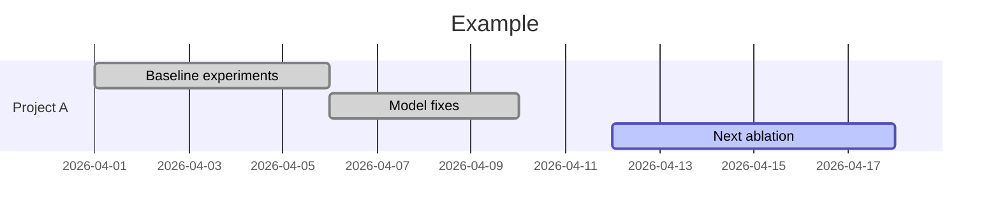

# Work Timeline Planner

Turn evidence such as git history, project documents, user descriptions, and chat notes into a readable timeline report. The output can be Markdown, standalone HTML, or both.

Use this skill for two main cases:

- retrospective review: what was done over a past period, across one project or multiple projects
- forward planning: what should happen next, when, and in what sequence

## Skill Directory Layout

```text
<installed-skill-dir>/
├── SKILL.md
├── references/
│   ├── evidence-model.md
│   ├── output-formats.md
│   └── report-modes.md
└── templates/
    ├── timeline-report.html
    └── timeline-report.md
```

## Progressive Loading

- Always read `references/evidence-model.md`
- Read `references/report-modes.md` when choosing between personal review, mentor report, planning report, or a hybrid
- Read `references/output-formats.md` when choosing between Markdown, HTML, or both, or when deciding between Mermaid, Frappe Gantt, and Plotly
- Use `templates/timeline-report.md` and `templates/timeline-report.html` as the output skeletons

## Core Principles

- Timeline blocks should be evidence-backed, not just commit-count-backed
- Commits are signals, not the full story; combine them with docs, notes, and user context
- Prefer a few meaningful work blocks over a noisy commit-by-commit chart
- Distinguish observed facts from inferred date ranges
- Keep audience in mind: personal multi-project review is broader; mentor-facing single-project reports should be tighter and more explanatory
- For planning, separate committed work from optional or stretch work
- Choose the lightest chart technology that still fits the user's use case

## Step 1 — Classify the Request

Identify the primary mode before gathering evidence:

- `personal-review`: review past work, often across multiple projects
- `mentor-report`: summarize past work for one project and one audience
- `next-phase-plan`: plan upcoming work with milestones and dependencies
- `hybrid`: summarize recent work and then propose the next phase

Also identify:

- time window
- project scope
- audience
- desired level of granularity
- output format: `markdown`, `html`, or `both`
- chart engine: `mermaid`, `frappe-gantt`, or `plotly`

If the user did not specify a time window, infer a reasonable one from context and state it explicitly in the report.

Default output policy:

- `markdown` + `mermaid` for shareable repo-native reports
- `html` + `frappe-gantt` for richer interactive review
- `both` when the user wants an archiveable report plus a better local visualization

## Step 2 — Gather Evidence

Prefer primary evidence first.

For each in-scope repo, gather:

```bash
git rev-parse --show-toplevel
git log --date=short --stat --reverse --since="<start-date>" --until="<end-date>"
git log --date=short --pretty=format:"%ad%x09%h%x09%s" --since="<start-date>" --until="<end-date>"
```

Then layer in:

- project docs such as `README.md`, `docs/`, `PROJECT.md`, `decision-log`, experiment logs, or progress notes
- user-provided notes or descriptions
- user-provided chat excerpts or meeting notes

If the user wants a multi-project review, gather evidence per project and keep project boundaries explicit.

If one or more repos or notes are missing, ask only for the minimum missing inputs needed to avoid hallucinating the timeline.

## Step 3 — Build Work Blocks

Convert raw evidence into a small set of work blocks.

Each block should have:

- project
- title
- date range
- type: implementation, experiment, debugging, writing, infra, planning, reporting, or review
- evidence basis
- short outcome

Do not map one commit to one Gantt task unless the user explicitly wants that level of detail.

Instead:

- merge related commits into one coherent block
- split blocks when the goal clearly changed
- use docs or notes to explain periods where work happened but commits alone are sparse

When a date range is inferred rather than explicit, say so in the text summary.

## Step 4 — Choose the Report Shape

Follow the guidance in `references/report-modes.md`.

As a default:

- for `personal-review`, group by project, then by workstream
- for `mentor-report`, group by project phase or deliverable, not by every technical branch
- for `next-phase-plan`, group by milestone and dependency

The final output should usually contain:

- a short scope summary
- an evidence note
- a chart or timeline visualization
- a concise narrative summary of the key blocks
- optional next-phase actions

## Step 5 — Write the Output Report(s)

Follow `references/output-formats.md`.

For Markdown output, use `templates/timeline-report.md` as the base structure.

For HTML output, use `templates/timeline-report.html` as the base structure.

The chart engine should usually be chosen like this:

- `mermaid`: default for lightweight Markdown reports kept in a repo or shared in chat
- `frappe-gantt`: default for standalone HTML that the user wants to inspect locally with a better UI
- `plotly`: use only when you already have clean structured task data and want an interactive timeline, especially from Python-driven workflows

For Markdown, the default Gantt should be Mermaid:

```markdown

```
```

Guidelines:

- use one section per project or milestone group
- keep task names short
- prefer readable blocks over exact but cluttered detail
- mark completed retrospective work with `done` when useful
- mark current or planned work with `active` or plain future tasks only when the timing is justified
- for HTML output, prefer one self-contained file over a many-file mini app unless the user explicitly wants a larger artifact

## Step 6 — Add Planning When Needed

If the user wants forward planning:

1. separate completed work from planned work
2. identify dependencies and blockers
3. propose milestone-sized blocks, not pseudo-precise day-by-day fiction
4. mark uncertainty explicitly

For planning, include:

- priority
- dependency
- expected outcome
- owner, if relevant

## Step 7 — Sanity-Check Before Finalizing

Before presenting the report, check:

- all major blocks are supported by actual evidence
- the time window is stated explicitly
- multi-project reports do not blur project ownership
- mentor-facing reports explain outcomes, not just activity
- planned work is not mixed with already completed work
- the chosen chart syntax or embedded data is structurally valid

## Output Expectations

The final output should usually be a document the user can keep or share.

If asked to save it into a repo, use a path that matches the user's purpose, for example:

- `docs/reports/work_timeline_YYYY_MM.md`
- `docs/reports/mentor_update_YYYY_MM.md`
- `docs/plans/next_phase_timeline.md`
- `docs/reports/work_timeline_YYYY_MM.html`
- `docs/reports/mentor_update_YYYY_MM.html`

If the user only wants a draft in chat, still structure it as if it could be saved directly to a file.
